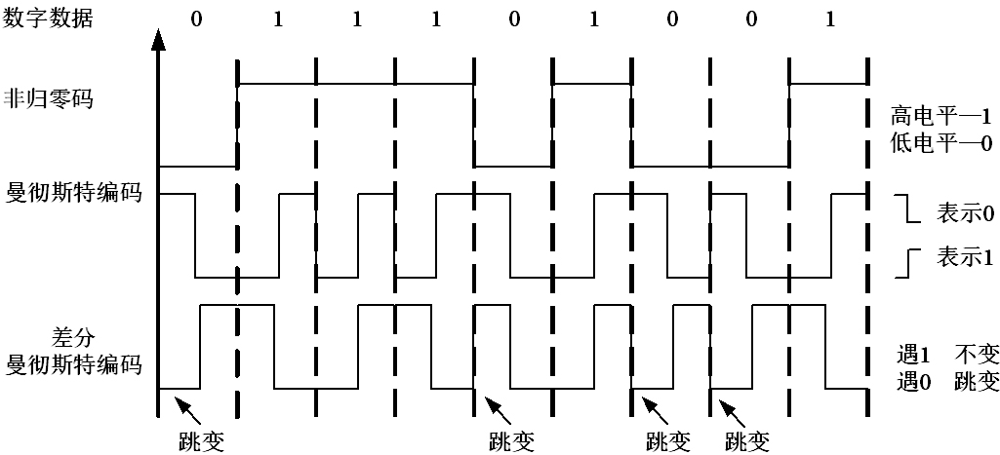

# 数据编码

：指将数据转换成用电平信号表示的过程。
- 原数据转换成电信号之后，就可以通过线路传输。

## 电信号的分类

- 模拟信号（analog signal）：电平连续变化的电信号。
- 数字信号（digital signal）：只有高低两种电平的脉冲电压信号。
  - 数字信号传输时的误码率低，速度快。

- 将模拟信号转换成数字信号（即数字化）的主要方法是**脉冲编码调制**，分为以下三步：
  - 采样：从电平连续变化的模拟信号中每隔一定时间取一个幅值作为样本，代表原信号。
  - 量化：将样本幅值分级量化。
  - 编码：将样本量级表示成二进制。

## 数据编码方法

- 将数据转换成模拟信号的主要编码方法：
  - 调幅
  - 调频
  - 调相
- 将数据转换成数字信号的主要编码方法：
  - 非归零码：用正电平表示1，用负电平表示0。
  - 曼彻斯特编码：前半周期发送该二进制位的反码，后半周期发送该二进制位的原码。两次电平跳变的间隔不是T/2就是T，信号的接收方可以依此校正时间基准。
  - 差分曼彻斯特编码：每个比特的中间电平跳变只是为了同步时间，比特的值由初始电平是否跳变决定，跳变表示0，不跳变表示1。
    - 差分曼彻斯特编码、曼彻斯特编码都是自含时钟编码，即采用内同步法。

    

## 调制解调器

：Modem，是调制器和解调器的简称，一般成对存在，分别位于传输线路的两端。在发送端，将数字信号调制成可在电话线上传输的模拟信号，在接收端，将模拟信号解调成数字信号。
- 基带信号：指没经过调制的原始电信号，分为模拟基带信号、数字基带信号两种。
- 调制信号：将原始电信号加在载波上调制得到的模拟信号。
- 频带传输：将数字信号调制成模拟信号后通过模拟信道传输，这样可以利用成熟的电话网，但是速度慢。
- 宽带传输：频带传输的一种，宽带是指信号的频带宽，与宽带相反的是窄带。
- 基带传输：将数据以数字信号的形式通过数字信道传输，速度快，距离短。
