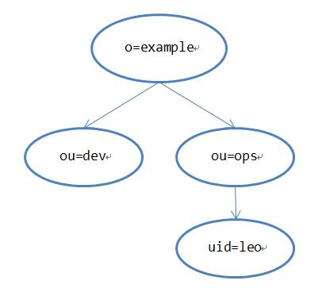

# LDAP

：轻型目录访问协议（Lightweight Directory Access Protocol），是一个管理树形结构数据的网络协议，也可当作 NoSQL 数据库使用。
- [官网](https://ldap.com/)
- 90 年代发布了 LDAP v3 版本，与 v2 版本不兼容。
- 采用 C/S 架构、TCP 通信。
  - server 负责存储数据。
  - client 可以访问 server ，对数据进行增删查改。
- 优点：
  - 适合存储和管理大量账号信息、电话簿、设备列表。
  - 大部分开源的网站服务器默认将账号信息存储到内置的数据库中，但也支持存储到 LDAP 中，从而允许用同一个账号、密码登录多个网站，实现单点登录。
- 缺点：
  - 有较大的学习成本、维护成本，相当于使用一种新数据库。
  - 管理 3 个以上的网站，每个网站管理 30 个以上的用户时，才能明显提高运维效率。

## 数据结构

### 条目

- LDAP 服务器上可以创建多个目录信息树（Directory Information Tree ，DIT），在其中按树形结构存储数据。
  - 与 SQL 型数据相比，树形结构的查询速度很快，但写入速度较慢。
  - 目录服务器代理（Directory Server Agent ，DSA）：指可以被 LDAP 客户端获取目录数据的服务器。

- LDAP 存储的每条数据称为条目（Entry）。
  - 添加一个条目时，首先要设置其属性，然后要设置其 RDN 。
  - LDAP 服务器上有一个 RootDSE 条目，DN 为空，用于记录服务器的信息。

- LDAP 的存储结构示例：

  


### 属性

- 每个条目要设置至少一个属性（Attribute），用于描述该条目某种方面的信息，格式为 `<attribute>: <value>` 。
  - attribute 和 value 都不区分大小写。
  - 一个条目可以拥有多条重复的属性，比如拥有多个 telephoneNumber 属性，通过 {0}、{1} 等序号区分。
- 每个属性有一个属性类型（AttributeType），用于定义属性值（Value）的语法。如下：

  属性                      | 别名   | 语法              | 描述            | 取值举例
  -|-|-|-|-
  user id                   | uid   | Directory String  | 用户 ID         | LeoHsiao
  commonName                | cn    | Directory String  | 姓名            | LeoHsiao
  surname                   | sn    | Directory String  | 姓              | Leo
  domain component          | dc    | Directory String  | 域名中的一个字段 | com
  organization              | o     | Directory String  | 组织、公司名称   | A
  organizationalUnit        | ou    | Directory String  | 单位、部门名称   | ops
  telephoneNumber           |       | Telephone Number  | 电话号码        | 123456

- 每个条目要选出至少一个属性键值对组合成一个字符串（用加号分隔），作为该条目的名称，称为 RDN（Relative DN）。
  - 例如： `cn=leo+telephoneNumber=123456`
  - 同一父节点下的各个子节点的 RDN 不能重复。
  - 如果 RDN 中包含 `#` `"` `+` `,` `;` `<` `>` `\` 等特殊字符，或者属性值以空格开头或结尾，则要用 `\` 转义。
  - `+` `,` `=` 字符被视作分隔符，左右可以加上任意个空格。

- 将一个条目在目录树的保存路径上的各个节点的 RDN 组合成一个字符串（用逗号分隔），作为该条目的唯一标识名，称为 DN （Distinguished Name）。
  - Unix 文件路径采用从左到右的组合顺序，而 DN 采用从右到左的组合顺序。
  - 实际上，添加一个条目时，由用户定义其 DN ，而 DN 的左侧第一个字段会被视作 RDN 。
    - 例如：如果一个条目的 DN 为 `uid=leo, ou=ops, o=example` ，则其 RDN 为 `uid=leo` ，父节点的 DN 为 `ou=ops, o=example` 。
  - 目录树的根节点称为 Root DN ，其 RDN 可以为空字符串。


### 对象类

- 每个条目可以继承任意个对象类（ObjectClass），从而继承它们的属性。
  - 比如继承 person 类之后，就可以使用其预先定义的姓（sn）、名（cn）、电话(telephoneNumber)、密码(userPassword)等属性。
- 对象类分为三大类：
  - 结构类型（Structural）：最基本的父类，每个条目必须继承且只能继承一个。
  - 抽象类型(Abstract)：不能被直接继承。
  - 辅助类型（Auxiliary）：每个条目可以继承任意个。
- 对象类的属性分为两类：
  - 必要属性（Required）：必须被继承。
  - 可选属性（Optional）：不一定被继承。
- 如果两个 ObjectClass 拥有某个相同的属性，则只会继承一次该属性。
- 常用的对象类如下：

  对象类               | 必要属性
  -|-
  account             | uid
  alias               | aliasedObjectName（用于引用另一个条目）
  country             | c
  dcObject            | dc（域名中的一个字段）
  ipHost              | cn、ipHostNumber
  mailAccount         | mail
  organization        | o
  organizationalUnit  | ou
  person              | cn、sn
  top                 | 没有属性，一般被 Root DN 继承

- 每个 AttributeType、ObjectClass 有一个唯一的对象标识符（OID），由数字和点组成。比如 `Oid: 1.3.6.1.1.1.0.0` 。
- LDAP 服务器通常自带了一些 Schema 文件，定义了大量 ObjectClass ，供用户使用。

## 配置

- LDAP 支持用 LDIF（LDAP Interchange Format） 格式的文本文件导入、导出数据，其语法如下：
  - 一个 LDIF 文件可以保存任意个条目，相邻的条目之间用至少一个空行分隔。
  - 每行写入一个 `key: value` 格式的参数，value 末尾不能有空格。
  - 用 # 声明单行注释。
  - 如果一行不为空且以空格开头，则将一个空格之后的内容附加到前一行之后，即使前一行是注释。
  - 例：
    ```ini
    dn: dc=baidu, dc=com    # 定义 dn
    objectclass: top        # 继承一个对象类
    objectclass: dcobject
    dc: com                 # 定义一个属性
    ```
- 同时只能对一个条目进行操作。
- 操作类型为 modify 时，还要选择 modify 的类型，如下：
  - add
    - ：指定一个属性名、一组属性值，从而增加一个属性。
    - 如果该属性已存在，则会报错。
  - delete
    - ：如果指定一个属性名，则删除该属性的所有值。如果指定一个属性名、一组属性值，则只删除该属性的指定值。
    - 如果要删除的目标不存在，则会报错。
  - replace
    - ：如果指定一个属性名，则删除该属性的所有值。如果指定一个属性名、一组属性值，则删除该属性的所有值，再加入指定的值。
  - increment
    - ：指定一个属性名、一个整数值（可以为负），从而对原本的属性值施加一定增量。

## 查询

- LDAP 的查询表达式可以由一个或多个属性过滤条件 filter 组成。
- filter 的语法为 `(<attribute><operator><value>)` ，其中常用的运算符包括 `=` `<=` `>=` 。
  - 运算符的前后不能插入多余的空格，否则可能产生歧义。
  - 每个 filter 要用一对括号作为定界符包住，除非查询表达式中只有一个简单的 filter 。
  - 条目的 dn 不算属性，不能用于查询，只能用作查询的起点。
- 对 filter 进行运算的语法为 `(<operator> 《filter>...)` ，其中常用的运算符包括 `&` `|` `!` 。
- 查询表达式示例：
  ```ini
  cn=test         # 查询包含该属性的条目
  cn=test*        # value 可以使用通配符
  (!(cn=test))
  (& (cn=test) (!(| (objectClass=top) (objectClass=dcObject) )) )
  ```
