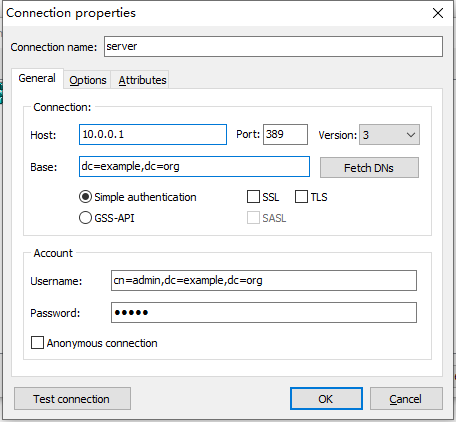

# Ldap Admin

：一个 GUI 类型的 LDAP 客户端软件，运行在 Windows 上，无需安装。
- [官网](http://ldapadmin.org/)
- 它会将连接服务器的凭据以明文形式保存在 Windows 的注册表中。

## 用法

打开软件之后，先连接到服务器，配置示例如下：



连接成功之后，会显示查询到的条目。可以在 GUI 界面中新增、编辑条目。如下：


## 对接 Jenkins 的示例

1. 在 LDAP 中创建用户、用户组。如下：
    ```ini
    # 根节点
    dn: dc=example,dc=org
    objectClass: top
    objectClass: dcObject
    objectClass: organization
    o: Example Inc.
    dc: example

    # 在该节点的目录之下创建用户
    dn: ou=people,dc=example,dc=org
    ou: people
    objectClass: organizationalUnit

    # 在该节点的目录之下创建用户组
    dn: ou=groups,dc=example,dc=org
    ou: groups
    objectClass: organizationalUnit

    # 定义一个表示用户的条目
    dn: uid=leo,ou=people,dc=example,dc=org
    objectClass: person
    objectClass: uidObject
    objectClass: mailAccount
    userPassword: {CRYPT}$5$UMEVzYGr$cl9AXM/RKRC9xIt08JVlyI3TQiqXQHVHJTQ8KTtgfP/    # 该示例中设置密码为 123456 ，采用 SHA-256 加密算法
    mail: 123456@qq.com
    cn: Leo                   # 可以存储中文名，用于显示
    sn: Leo                   # 姓氏
    uid: leo                  # 用于存储英文名，用于登录

    # 定义一个表示用户的条目
    dn: uid=will,ou=people,dc=example,dc=org
    objectClass: person
    objectClass: uidObject
    objectClass: mailAccount
    userPassword: {CRYPT}$5$UMEVzYGr$cl9AXM/RKRC9xIt08JVlyI3TQiqXQHVHJTQ8KTtgfP/
    mail: 123456@qq.com
    cn: Will
    sn: Will
    uid: will

    # 定义一个表示用户组的条目
    dn: cn=viewer,ou=groups,dc=example,dc=org
    objectClass: groupOfNames
    cn: viewer
    member: uid=leo,ou=people,dc=example,dc=org
    member: uid=will,ou=people,dc=example,dc=org

    # 定义一个表示用户组的条目
    dn: cn=admin,ou=groups,dc=example,dc=org
    objectClass: groupOfNames
    cn: admin
    member: uid=leo,ou=people,dc=example,dc=org
    ```
    - 每个用户组可以声明多个 member 属性，每个 member 属性的值为某个条目的 dn ，表示成员关系。

2. 进入 Jenkins 的 `Configure Global Security` 页面，启用 LDAP 认证，配置如下：
    ```ini
    Server                          ldap://10.0.0.1:389
    root DN                         dc=example,dc=org                           # 查询的起点，越准确越能减少查询耗时
    User search base                ou=people                                   # 到哪个目录之下查询用户
    User search filter              uid={0}                                     # 查询用户的表达式，这里的 {0} 会被 Jenkins 替换成具体的登录名，改成 mail{0} 就是用邮箱作为登录名
    Group search base               ou=groups                                   # 到哪个目录之下查询用户组
    Group search filter             (& (cn={0}) (objectclass=groupOfNames))     # 查询用户组的表达式
    Group membership                Search for LDAP groups containing user      # 识别用户组的策略，这里是根据 member 属性判断用户组
    Manager DN                      cn=root,dc=example,dc=org                   # 登录 LDAP 服务器的账号
    Manager Password                ******
    Display Name LDAP attribute	    cn                                          # 用户认证成功之后，显示的用户名称
    Email Address LDAP attribute    mail                                        # 显示的用户邮箱
    ```
    配置之后可以测试认证一个用户，Jenkins 会显示详细的提示信息，如下：
    ```ini
    Authentication: successful                    # 认证成功
    User ID: Leo                                  # 查询到的用户属性
    User Dn: uid=leo,ou=people,dc=example,dc=org
    User Display Name: Leo
    User email: 123456@qq.com
    LDAP Group membership:                        # 查询到包含该用户的的用户组
      · viewer
      · admin
    ```

- 认证流程：
  1. 用户登录 Jenkins ，输入登录名和密码。
  1. Jenkins 向 LDAP 服务器发出查询请求，在 ou=people 目录下查询与登录名匹配的用户。如果存在则允许登录，否则拒绝登录。
  2. Jenkins 到 ou=groups 目录下查询包含该用户的用户组（可能存在多个）。查询表达式大概如下：
      ```ini
      (& (objectClass=groupOfNames) (member=cn=Leo,ou=people,dc=example,dc=org))    # 查询 groupOfNames 类型，且包含指定用户的条目
      ```
  3. Jenkins 根据自身的权限策略，判断该用户、用户组应该分配什么权限。

- 缺点：
  - 查询到多个同名的用户时可能出错。
  - 新增用户时不能自动加入用户组。
    - 例如：创建一个表示用户组的条目 ou=admin ，在其下创建一个表示用户的条目 cn=Leo 。该用户并不会自动成为该用户组的成员，需要手动给用户组添加 member 属性。
    - 不过删除一个用户时，会自动删除所有用户组中引用它的 member 属性。
  - 大部分 LDAP 客户端不支持自动查询嵌套组（nested group），因此定义大量用户组时总是需要逐个加入用户，很麻烦。
    - 嵌套组是指一个用户组是另一个用户组的 member 。
    - 例如：将用户 cn=Leo 声明为用户组 ou=admin 的 member ，将用户组 ou=admin 声明为用户组 ou=viewer 的 member 。大部分客户端只会发现用户 cn=Leo 属于用户组 ou=admin ，不会发现该用户还属于用户组 ou=viewer 。

## LTB project

：提供了一些 LDAP 工具。
- [官网](https://ltb-project.org/)

常用工具：
- `Self Service Password` ：一个采用 PHP 开发的网站，允许用户通过 Web 页面自行修改密码，而不需要 LDAP 管理员修改。
- `White Pages` ：一个采用 PHP 开发的网站，允许用户搜索、查看 LDAP 中的数据。
- `Service Desk` ：一个采用 PHP 开发的网站，供 LDAP 管理员锁定、重置用户密码。
