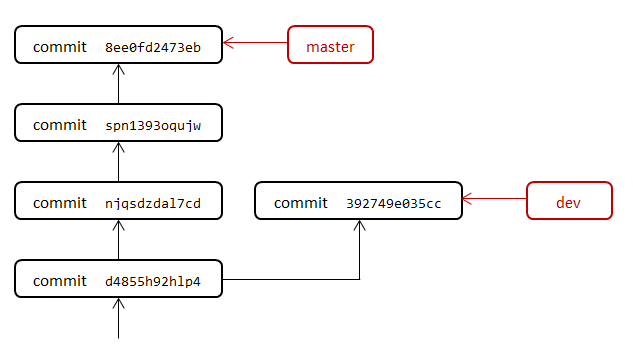
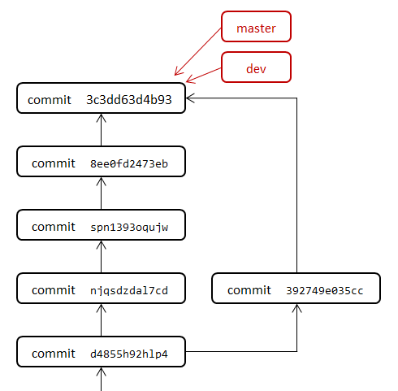
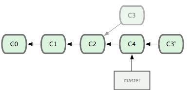

# Git

：一个流行的版本控制工具。
- [官方文档](https://git-scm.com/docs)
- 采用 C 语言开发。2005 年由 Linus Torvalds 发布。
- 特点：
  - 分布式管理。每个服务器、客户端都存储一份独立的代码仓库，可以相互同步。
  - 支持将每次修改后的文件提交为一个版本，允许用户将文件回滚到任意历史版本。
  - 支持创建多个分支，进行分支切换、合并，便于多人合作开发同一个项目。

## 安装

1. 在 CentOS 上安装 git ：
    ```sh
    yum install git
    ```
    在 Windows 上推荐再安装 git 的 GUI 工具，比如 Tortoisegit 。

2. 初始化配置：
    ```sh
    git config --global user.name "name"
    git config --global user.email "you@example.com"
    ```
    每次执行 `git commit` 时都会自动备注提交者的用户名和邮箱。

## 基本用法

1. 用户进入项目根目录，执行 `git init` 命令进行初始化。
    - 这默认会在当前目录下创建一个 .git 子目录，作为 git 仓库，存储 git 的相关文件。

2. 用户执行 `git commit` 命令，将项目文件提交为一个版本，让 git 记录。
    - git 默认会记录项目目录下的所有文件，可以在 .gitignore 文件中声明不想被 git 记录的文件。
    - git 会将这些文件拷贝一份到 git 仓库中，根据哈希值识别它们。
    - git 会记录当前时刻所有文件的哈希值，记作一个版本。

3. 每次用户修改文件的内容之后，都应该执行 `git commit` 命令，将当前时刻的所有文件提交为一个新版本。
    - 如果文件的哈希值发生变化，git 就认为文件的内容已经改变，会将改变之后的文件拷贝一份到 git 仓库中。不改变的文件则不会拷贝。

4. 用户执行 `git checkout xxx` 命令，切换到历史版本。
    - git 会找到该版本对应的所有文件的哈希值，根据哈希值将这些文件从 git 仓库拷贝到项目目录下，从而将项目目录还原到历史时刻。

## 版本

### 修改

```sh
git status                    # 显示当前 git 仓库的状态（包括当前的分支名、缓存区内容）

git add <path>...             # 将指定文件加入缓存区。如果指定一个目录，则递归加入其下所有文件
        -u                    # 如果有文件不匹配 path ，但已被 git 管理，则也加入缓存区。与 git add . 相比，git add -u 能发现已删除的文件，但不能发现新增的文件
        -A                    # 相当于 git add . 加 git add -u

git rm <file>                 # 删除某个文件
      --cached                # 从缓存区删除

git mv <src_file> <dst_file>  # 移动文件
```
- 被修改的文件建议先加入 git 缓存区（称为 stage、index），以便之后提交成一个版本，永久保存到 git 仓库中。
  - 也可以不加入缓存区就直接 git commit 。
  - 如果一个文件相对上一版本未被改动，或者被 .gitignore 文件忽略，则不会添加到缓存区。
  - 用 git rm/mv 做出的改动会自动加入缓存区。
- 在 Windows 上重命名一个文件时，如果只是改变了文件名的大小写，git 默认不会发现该改动，此时建议通过 git mv 重命名文件。

### 提交

```sh
git commit                      # 将当前缓存区的所有文件提交为一个版本
          -m "initial version"  # 加上备注信息（该选项为强制要求）
          -a                    # 提交从上一个版本以来被改动的所有文件
          --amend               # 将当前的缓存区合并到上一个版本（不过时间戳依然是上一个版本的）
          -S                    # 添加 GPG 签名
```
- 每提交一个版本时，会自动生成一个 SHA-1 哈希值，作为 commit ID、version name 。如下：
	```sh
	commit 86e696bd125aa895e067c2216ae8298289ab94d6
	Author: Leo <leohsiao@foxmail.com>
	Date:   Thu Dec 10 09:15:19 2020 +0800
	```
	- 该哈希值的长度为 40 位，不过用户只使用前几位也能定位到该版本，比如 git checkout 86e696 。
- 假设在 git 仓库创建一个分支 test ，提交几个 commit ，然后删除分支 test 。
  - 此时，这些 commit 不在任何 branch 或 tag 的版本树上，称为孤立提交（orphan commit）。可执行 `git gc` 来清理。

### 撤销

```sh
git clean [path]...     # 删除指定目录（默认为当前目录）下，所有未被 git 版本控制，或不在 .gitignore 中记录的文件
          -d            # 递归子目录
          -f            # 强制删除
          -x            # 将 .gitignore 中记录的文件也删除
          -e <pattern>  # --exclude ，排除一些文件，不删除

git reset [refs]        # 将当前分支指向目标版本（默认是最近一个版本）
          --soft        # 不改变工作目录的文件（即依然处于原版本），将与目标版本不同的所有文件添加到缓存区
          --mixed       # 不改变工作目录的文件，清空缓存区。默认采用该方式
          --hard        # 改变工作目录的文件（即变为目标版本），并清空缓存区

git revert <refs>...    # 自动提交一个新版本来抵消某个历史版本的变化（这样不会删除历史版本）
          -n            # --no-commit ，只是修改文件并加入缓存区，不自动提交。默认会为撤销的每个历史版本，提交一个新版本
```
- 撤销文件的常用命令：
  ```sh
  git checkout .            # 将文件复原到当前版本

  git clean -dfx            # 清理未被版本控制的文件
  git reset --hard          # 复原项目文件，清空缓存区

  git revert HEAD           # 撤销最近一个版本
  git revert HEAD~5..HEAD   # 撤销一连串版本，即还原到 HEAD~5 版本
  ```
  - 通过 git checkout 可以将 HEAD 分支切换到历史版本，此时可新建分支来修改。而通过 git revert 可以将文件还原到历史版本，可作为新版本提交，继续在当前分支工作。
- 从 git 仓库的所有版本中永久删除某个文件：
  ```sh
  git filter-branch --force --index-filter 'git rm --cached --ignore-unmatch <文件的相对路径>' --prune-empty --tag-name-filter cat -- --all
  git push origin --force --all --tags    # 强制推送，覆盖远程仓库
  ```

### .gitignore

- 不受 git 版本控制的文件主要有两种：
  - 新增的文件，尚未加入版本控制。
  - 被 .gitignore 忽略的文件。
- 可以在项目根目录下创建一个 .gitignore 文件，声明一些文件让 git 不进行版本控制。如下：
  ```sh
  /test.py        # 忽略项目根目录下的指定文件
  /log/*.log      # 忽略 log 目录下的一些文件
  __pycache__/    # 忽略所有目录下的指定目录
  ```
  - .gitignore 根据文件相对于项目根目录的完整路径进行匹配，可以使用通配符 * 、? 。
  - 以 / 开头的路径，是从项目根目录开始，匹配方向是明确的。不以 / 开头的路径，可能匹配到多个目录下的文件。
  - 以 / 结尾的路径，是强调匹配目录，不匹配文件。
  - 如果一个目录为空，或者只包含空目录，则会被 git 忽略，相当于该目录不存在。

## 引用

- 因为 commit 版本的哈希值不方便记忆，git 支持创建以下几种引用（Reference ，refs），用于指向某个 commit 版本。
  - commit ID 也算 refs 。
  - 分支（branch）：指向某个版本，且可以随时改为指向其它版本，相当于指针。常见分支：
    - master ：git 仓库初始化时，默认创建的一个分支，通常用作主分支。
    - HEAD ：git 仓库内置的一个特殊分支，指向用户当前所处的版本。
      - 还可通过 HEAD~n 的格式指向 n 次 commit 之前的版本，例如 HEAD~0 指向当前版本，HEAD~1 指向上一个版本。
  - 标签（tag）：指向某个版本，且创建之后不能改为指向其它版本，相当于某个版本的别名。

### branch

```sh
git branch          # 显示所有本地分支
        -a          # 增加显示 tracked 的远程分支，分支命名格式为 remotes/origin/<branch>
        -v          # 显示每个分支所在的版本
        <branch>    # 新建一个分支，默认以 HEAD 分支为源
          -d        # 删除分支，需要该分支已合并到其它分支
          -D        # 强制删除分支
```

### checkout

```sh
git checkout
        [refs]          # 将当前分支切换到某个 refs 指向的版本，如果不指定则选中当前版本
              <path>... # 不切换，而是将指定路径的文件改为目标版本的状态
        -b <branch>     # 切换到指定分支，如果该分支不存在则自动创建
              <refs>    # 切换分支之后，再将该分支切换到 refs 版本
```
- 如果用 `git checkout` 切换到一个 tag 或 commit ，则不会绑定分支，会提示：`You are in 'detached HEAD' state.` 。此时可以执行 `git fetch` ，但不能执行 `git pull` ，否则会报错：`You are not currently on a branch`
- 例：
  ```sh
  git checkout HEAD~1 f1    # 将指定文件回滚到上一个版本

  ```

### tag

```sh
git tag                 # 显示已有的所有标签
        -a v1.0 9fceb02 # 给版本 9fceb02 加上标签 v1.0
        -d <tagName>    # 删除一个标签
```

### merge

```sh
git merge <branch>  # 将指定分支的所有版本合并到当前分支
```
- 合并时，如果目标分支不包含当前分支没有的版本，则合并后当前分支不会变化。否则，合并后会产生一个新版本，以解决两个分支的差异。

示意图：
1. 用户提交的历史版本会按先后顺序排列成一条线，如下：

	

2. 如果用户想重新修改某个历史版本，就创建一个 dev 分支，指向该分支，如下：

	

3. 用户在 dev 分支上提交出另一个版本，则版本树就从一条线分叉成了多条线。如下：

	

4. 用户可以将 dev 分支合并到 master 分支，从而将版本树合并成一条线。如下：

	

	合并两个分支时，如果两个分支包含不同路径的文件，则会自动合并。如果包含相同路径的文件，但内容不同，就会产生冲突，必须解决冲突才能合并。
	- 如果 master 分支中包含文件 1.txt ，dev 分支中不包含文件 1.txt ，则 git 会保留文件 1.txt ，自动合并。
	- 如果 master 分支中文件 1.txt 的内容全为大写，dev 分支中文件 1.txt 的内容全为小写，则用户需要手动确定合并之后文件 1.txt 的内容是什么。

### rebase

```sh
git rebase
        <branch>          # 将当前分支以变基方式合并到指定分支，这会产生一个新 commit
        branch1 branch2   # 将 branch2 以变基方式合并到 branch1
        branch1 branch2 --onto branch3  # 将 branch2 相对于 branch1 的变基应用到 branch3 上
```

- 如下图，假设在 Git 仓库的 master 分支上依次提交了 C0、C1、C2、C4 版本。此时有人 fork 了 C2 版本，做出修改，生成 C3 版本。
  - 如果以 merge 方式将 C3 合并到 C4 ，则可能存在合并冲突，需要手动处理。
  - 如果以变基（rebase）方式将 C3 合并到 master ，则会自动找到 C3 与 C4 的共同祖先 C2 。然后删除 C3 ，将从 C2 到 C3 之间的所有变化拷贝提交到 C4 ，生成一个新版本 C3' 。最后将 master 分支指向 C3' 版本。

  

- merge 与 rebase 方式最终生成的版本都一样，但是 rebase 方式会删除分叉的分支，将版本图简化成一条线。

### cherry-pick

```sh
git cherry-pick <commit_hash>...  # 提取多个 commit 的修改内容，拷贝提交到当前分支。支持提交到其它 Git 仓库
        -n                        # 只更新文件，不提交
```
- cherry-pick 适合在差异较大的分支之间拷贝一些 commit 变化，甚至拷贝到其它 Git 仓库。
  - 假设修改了 master 分支的 .gitignore 文件，然后想同步到其它分支。如果采用 merge、rebase 方式，则需要将 master 分支合并到其它分支，可能修改大量文件。而采用 cherry-pick 方式，则只会修改 .gitignore 文件。

### log

```sh
git log [refs]              # 显示某个分支上的 commit 日志，不指定 refs 则采用 HEAD 分支
        [path]              # 可指定 path ，只显示与指定文件相关的 commit
        -n                  # 最多显示 n 个 commit
        --reverse           # 倒序显示各个 commit 。默认按时间从新到旧排序，该选项会从旧到新排序
        --since=<date>      # 只显示指定时刻之后的 commit 。date 可以是 2022-01-01T12:00:00 或 "1 hours ago" 的格式
        --until=<date>      # 只显示指定时刻之前的 commit
        --author=<pattern>  # 只显示提交者与 pattern 正则匹配的 commit
        --format=<format>   # 设置每个 commit 的显示格式，比如 oneline、reference、fuller ，还可以是 format:%h,%cI,%s 这样的格式字符串
        --show-signature    # 增加显示每个 commit 的 GPG 签名

git reflog                  # 显示 Git 仓库的所有 commit 日志

git show [object]           # 显示某个对象的信息
        --format=full

git diff <refs> <refs>      # 显示从一个版本到另一个版本的差异，包括差异文件、文件内增删的每行
        --stat              # 只显示统计信息，包括差异文件列表、增减的行数
        --name-status       # 只显示差异文件列表、文件动作的缩写（比如 A 新增、D 删除、M 修改、R 重命名）
        --name-only         # 只显示差异文件列表
        --no-renames        # 不自动识别 rename 动作，直接显示 create、delete

git ls-remote               # 列出远程仓库的所有 refs
    --heads                 # 只列出所有分支，格式如 refs/heads/master
    --tags                  # 只列出所有标签，格式如 refs/tags/v1.0

git for-each-ref
    --points-at=<name>      # 列出与一个名称相关的所有 refs

git rev-parse
    --show-toplevel         # 返回 Git 项目的顶级目录

git gc                      # 清理磁盘文件，比如删除 orphan commit 、删除重复文件
```

## 配置

- Git 的配置文件有三种，局部的配置会覆盖全局的配置：
  - 系统的配置文件：保存在 `/etc/gitconfig` 。
  - 当前用户的配置文件：保存在 `~/.gitconfig` 。
  - 当前目录的 Git 仓库的配置文件：保存在 `.git/config` 。

- 可以用 vim 命令修改 Git 的配置文件，也可以用以下命令修改：
  ```sh
  git config
            --system      # 使用系统的配置文件
            --global      # 使用当前用户的配置文件
            --local       # 使用当前 git 仓库的配置文件

            -l            # --list ，显示配置文件的全部内容
            -e            # --edit ，在文本编辑器中打开配置文件

            <key>         # 显示配置文件中某项参数的值
            <key> <value> # 设置配置文件中某项参数的值
  ```

- Git 配置文件为 INI 格式，下方是一个 Git 仓库的配置示例：
  ```ini
  [core]
      repositoryformatversion = 0 # 仓库格式的版本
      filemode   = true           # 是否保留文件权限中的可执行位
      bare       = false          # 该仓库是否为裸仓库
      ignorecase = false          # 是否忽略文件名的大小写

  [remote "origin"]               # 定义一个远程仓库，名为 origin
      url    = https://github.com/LeoHsiao1/test.git
      fetch  = +refs/heads/*:refs/remotes/origin/*    # 格式为 [+]<src>:<dst> ，表示让本地分支 src 跟踪远程分支 dst

  [branch "master"]
      remote = origin
      merge  = refs/heads/master
  ```

- 通过 git pull、git push 同步 Git 仓库时，会同步受版本控制的所有文件，但不会同步 Git 仓库的配置文件，比如 `.git/config`、`.git/hooks` 。
  - .gitmodules 文件受版本控制，因此会同步。

### hooks

- 用户可以给 Git 仓库添加一些钩子（hooks），用于在发生某些 Git 操作时，自动执行自定义的 shell 脚本。
- git hooks 保存在 `.git/hooks` 目录下，例如：
  ```sh
  .git/hooks/
  |-- pre-commit.sample
  |-- pre-push.sample
  |-- pre-rebase.sample
  `-- ...
  ```
  默认有一些名为 `<hook_name>.sample` 的 shell 脚本，将脚本重命名为 `<hook_name>` 即可生效。

- 常见的钩子：
  ```sh
  pre-commit      # 每次执行 git commit 操作之前，触发该钩子
  post-commit     # 每次执行 git commit 操作之后，触发该钩子
  pre-push
  post-checkout
  pre-receive     # 用于 Git 服务器，每次执行 git-receive-pack 操作之前，触发该钩子
  post-receive    # 用于 Git 服务器，每次执行 git-receive-pack 操作之后，触发该钩子
  ```

### submodule

：子模块，用于在当前 git 仓库中以子目录的形式引用其它 git 仓库。
- 相关命令：
  ```sh
  git submodule
                add <repository_url> [<path>] [--name <name>] [-b <branch>]   # 添加 submodule
                update          # 从远程仓库拉取 submodule ，根据记录的 commit id
                      --remote  # 根据 .gitmodules 中配置的 branch 进行拉取
                      --recurse # 递归拉取所有嵌套的 submodule
                sync            # 将 .gitmodules 文件中的配置同步到 .git/config 中（默认不会自动同步）
                status          # 显示所有 submodule 的 commit、path、branch 信息
  ```
- 添加了 submodule 之后，会在项目根目录生成一个 .gitmodules 文件，用于保存其配置信息。如下：
  ```ini
  [submodule "python_utils"]                            # submodule 的名称
    url = https://github.com/LeoHsiao1/python_utils.git # submodule 的仓库地址，会通过 git clone 命令下载
    path = submodules/python_utils                      # 将该 submodule 下载到哪个目录
    branch = master                                     # 引用的分支
  ```
  还会在 `.git/config` 中记录 submodule 的信息，如下：
  ```ini
  [submodule "python_utils"]
    active = true
    url = https://github.com/LeoHsiao1/python_utils.git
  ```
  - 如果想移除一个 submodule ，需要在上述两个配置文件中删除它。
- 进入 submodule 的目录之后，就相当于处于其 git 仓库下，可以执行 git checkout 等命令。
  - 当前 git 仓库会引用 submodule 的某个 commit 版本，不会自动更新，需要手动更新：
    ```sh
    cd submodule_dir/
    git pull
    cd ..
    # 以上命令可简化为 git submodule update --remote --merge

    git add .
    git commit -m 'Updated submodule'
    git push
    ```

## 远程仓库

拥有一个 git 服务器之后，就可以将本地的 git 仓库推送到服务器存储，或从服务器拉取 git 仓库。
- 一个本地仓库可以配置 0 个或任意个远程仓库。
  - 配置之后，通过 URL 或 name 即可引用远程仓库。
  - 本地仓库的分支需要与远程仓库的分支建立一对一的关系，称为跟踪（tracked），才能通过 pull、push 的方式同步分支。
  - 例：git clone 时，默认将远程仓库命名为 origin ，并让本地分支 master 跟踪远程分支 origin/master 。

- 本地仓库与远程仓库之间，有两种传输方式：
	- 基于 SSH 协议：
		1. 先生成一对 SSH 密钥，将密钥保存在本机的 ~/.ssh/id_rsa 文件中，将公钥保存到 git 服务器上。
		2. 然后在本机连接到 git 服务器，使用私钥文件进行认证。
	- 基于 HTTPS 协议：
		1. 先在 git 服务器上创建账号。
		2. 然后在本机连接到 git 服务器，输入账号、密码进行认证。 \
       不过每次 pull、push 都需要输入账号、密码，可以将输入的凭证缓存起来：
        ```sh
        git config --global credential.helper cache   # 将凭证在内存中缓存 15 分钟
        git config --global credential.helper store   # 将凭证持久保存，以明文形式保存到 ~/.git-credentials 文件中
        ```

- 常见的 git 服务器：
  - GitLab ：提供了代码托管、项目管理、Wiki、CI 等丰富的功能，比较繁重。可使用公网版、私有部署版。
  - GitHub ：功能比 GitLab 少些。只可使用公网版。
  - Gogs   ：只有代码托管功能，轻量级。可使用公网版、私有部署版。
  - Gitee  ：从 Gogs 分叉而来，功能更多，页面像 GitHub 。

### 相关命令

```sh
git clone <URL> [dir]           # 将一个远程仓库克隆到本地，默认是保存到一个与仓库同名的子目录中
        -b <branch>             # 切换到指定分支，默认是远程仓库的 HEAD 分支
        --depth <n>             # 浅克隆（shallow clone），只下载最近的 n 个版本的文件，默认会下载全部版本
        --recursive             # 递归克隆所有 submodule ，默认不会克隆 submodule

git remote                      # 显示已配置的所有远程仓库的名字
        -v                      # 显示各个远程仓库的 URL
        show <name>             # 显示某个远程仓库的地址、所有 tracked 的远程分支
        add <name> <URL>        # 添加一个远程仓库，并设置其名字
        rm <name>               # 删除一个远程仓库
        rename <name> <name>    # 重命名一个远程仓库

git fetch [name 或 URL]         # 拉取远程仓库的最新内容（包括分支、标签），但只是下载到本地仓库，不会修改本地分支
        --all                   # 拉取所有远程仓库（默认只是 origin 仓库）
        --tags                  # 拉取标签
        --prune                 # 如果一个 tracked 的远程分支在远程仓库不存在了，则在本地仓库删除 tracked 关系，但不会影响本地分支
        --dry-run

git pull [name 或 URL]          # 先 fetch 远程仓库，然后将所有 tracked 的远程分支合并到本地分支

git push [name 或 URL]          # 推送本地仓库到远程仓库。默认会推送所有 tracked 分支，但不会推送 tag
        --force                 # 强制推送，即清空远程仓库后再上传本地仓库
        --all                   # 推送本地仓库的所有分支。如果不存在 tracked 的远程分支，则自动创建它
        <tag>                   # 推送一个标签
        --tags                  # 推送所有标签
        --delete origin <refs>  # 删除远程的分支或标签
```
- 执行 git fetch、pull、push 时，如果不指定远程仓库，则默认使用 origin 仓库。
- 执行 git push 时，会先把要传输的 commit 打包为一个 pack 文件，然后用 git-send-pack 命令发送到服务器。而服务器会用 git-receive-pack 命令接收 pack 文件。
  - 有的服务器会限制单次 push 的 pack 文件的最大体积，比如 10M 。
- 例：推送一个本地分支到远程仓库
  ```sh
  git push origin master : origin/master # 推送分支 master 到远程仓库 origin ，并与远程分支 master 合并
  git push origin : origin/master        # 推送一个空分支（这会删除指定的远程分支）
  ```
- 例：在远程仓库创建一个 test 分支，在本地仓库使用
  ```sh
  [root@CentOS ~]# git branch -a                # 查看当前分支，此时没看到远程分支 test
  * master
    remotes/origin/HEAD -> origin/master
    remotes/origin/master

  [root@CentOS ~]# git fetch                    # 拉取远程仓库
  From https://github.com/LeoHsiao1/Notes
  * [new branch]      test       -> origin/test

  [root@CentOS ~]# git branch -a                # 此时可看到远程分支 test
  * master
    remotes/origin/HEAD -> origin/master
    remotes/origin/master
    remotes/origin/test

  [root@CentOS ~]# git checkout test            # 切换到本地分支 test ，这会自动创建它，并跟踪到远程分支 test
  Switched to a new branch 'test'
  Branch 'test' set up to track remote branch 'test' from 'origin'.

  [root@CentOS ~]# git checkout test2           # 切换到本地分支 test2 ，这不会自动创建它，因为不存在对应的远程分支
  error: pathspec 'test2' did not match any file(s) known to git

  [root@CentOS ~]# git branch -a                # 查看此时的分支
    master
  * test
    remotes/origin/HEAD -> origin/master
    remotes/origin/master
    remotes/origin/test
  ```

### 裸仓库

- 执行 `git init --bare` 会创建一个裸仓库。
  - 它不会创建 .git 子目录，而是将 git 仓库中的文件直接存储到项目根目录。并且通常将项目根目录加上扩展名 .git 。
  - 它不支持提交 commit ，只能通过 push 的方式修改，因此常用于在服务器上存储远程仓库，供多人推送修改。

### LFS

- Git LFS（Large File Storage）：Git 的一种插件，用于存储大文件。
  - 原理：将一些大文件存储在 Git 仓库外部（位于 `.git/lfs/` 目录下），只在 Git 仓库内通过指针引用。在 pull 远程仓库时，默认只拉取当前版本的大文件。
  - 相关命令：
    ```sh
    yum install git-lfs     # 安装 lfs
    git lfs track "*.jpg"   # 将文件标记为大文件，被 lfs 跟踪
    ```

## 相关概念

### SCM

Git 属于软件配置管理（Source Code Management ，SCM）工具，同类产品包括：
- Subversion ：简称为 svn 。
  - 集中式管理。代码仓库存储在服务器上，用户需要通过客户端连接服务器，才能拉取代码或提交代码。
  - 以多个子目录的形式管理代码仓库，目录结构如下：
    ```sh
    repository/
    ├── branches  # 存放各个分支的项目代码
    ├── tags      # 存放各个版本的项目代码
    └── trunk     # 存放主干分支的项目代码
    ```
  - 支持只拉取或提交指定路径的目录、文件，而不必拉取整个代码仓库。
- Mercurial ：采用 Python 开发。

### git flow

：一种流行的 git 使用策略，适合管理复杂的项目。
- 在 git 仓库中至少使用以下两个分支：
  - master 分支：用于保存正式发布的版本。
  - dev 分支：用于保存开发环境的版本。平时的代码都提交到 dev 分支，发布稳定版本时才合并到 master 分支。
- 可以视情况创建以下临时分支：
  - feature 分支：从 dev 分支创建，用于开发一个新功能，完成之后就合并到 dev 分支。
  - hotfix 分支：从 dev 分支创建，用于解决一个 bug ，完成之后就合并到 dev 分支。
  - release 分支：从 dev 分支创建，用于发布一个新版本，测试通过之后就合并到 master 分支，并加上一个 tag ，声明版本号。
- 对 git 仓库加上权限控制，比如：
  - 禁止对 master 分支 push -f 。甚至禁止直接 push ，只允许将其它分支的代码通过 PR 合并到 master 分支。
  - 提出合并到 master 分支的 PR 时，必须经过其他人 review 同意，才能合并。
- 建议在 commit comment 的开头声明该 commit 的大致类型，便于分类整理。例如：
  ```sh
  # 宽泛的分类
  Add       function test1()
  Delete    ...
  Modify    ...

  # 更准确的分类
  Update    ...     # 少许改进、增加内容
  Optimize  ...     # 明显优化
  Rewrite   ...     # 重写部分内容，比如函数
  Refactor  ...     # 重构整个或部分系统
  Fix       bug 20200101_001

  # 加上 [] 的分类
  [CI]   ...
  [DOC]  ...
  [TEST] ...
  ```

### GPG 签名

GitHub、GitLab 等平台支持生成 commit ID 的数字签名，保存在 commit comment 中。步骤如下：
1. 用户生成一对 GPG 私钥、公钥，在其中记录自己的用户名、邮箱地址。
2. 用户使用私钥签署每个 commit 。
    ```sh
    git config --global user.signingkey ******
    git commit -S -m "..."
    git push
    ```
3. 用户在平台的设置页面登记 GPG 公钥，平台会自动验证各个 commit 的签名是否有效。
    - 如果有效，则显示一个 Verified 标志，证明该 commit 是由该用户提交的，并且 commit 内容没有被篡改。
