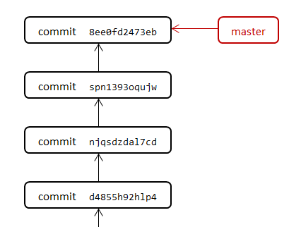
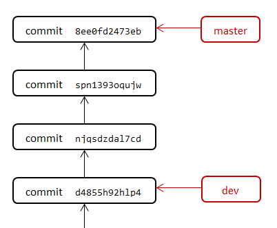

# Git

：一个分布式的版本控制工具。
- [官方文档](https://git-scm.com/docs)
- 2005 年，由 Linus Torvalds 基于 C 语言开发。
- 可以记录文件每次修改时的状态，供用户将文件回滚到任意历史时刻。
- 可以创建多个版本分支，进行分支合并，供多人合作开发同一个项目。
- 属于软件配置管理（Software Configuration Management ，SCM）工具，同类产品包括：
  - Subversion ：简称为 svn ，一个集中式的版本控制工具。用户需要通过客户端连接服务器，才能拉取代码或更新代码。
  - Mercurial ：基于 Python 开发。

## 安装

1. 在 CentOS 上安装 git ：
    ```sh
    yum install git
    ```
    在 Windows 上推荐再安装 git 的 GUI 工具，比如 Tortoisegit 。

2. 初始化配置：
    ```sh
    git config --global user.name "name"
    git config --global user.email "you@example.com"
    ```
    每次执行 `git commit` 时都会自动备注提交者的用户名和邮箱。

## 基本用法

1. 用户进入项目根目录，执行 `git init` 命令进行初始化。
	- 这默认会在当前目录下创建一个 .git 子目录，作为 git 仓库，存储 git 的相关文件。
  - 执行 `git init --bare` 会创建一个裸仓库。
    - 它不会创建 .git 子目录，而是将 git 仓库中的文件直接存储到项目根目录。并且通常将项目根目录加上扩展名 .git 。
    - 它不支持提交 commit ，只能通过 push 的方式修改，因此常用于在服务器上存储远程仓库，供多人推送修改。

2. 用户执行 `git commit` 命令，将项目文件提交为一个版本，让 git 记录。
  - git 默认会记录项目目录下的所有文件，可以在 .gitignore 文件中声明不想被 git 记录的文件。
  - git 会将这些文件拷贝一份到 git 仓库中，根据哈希值识别它们。
  - git 会记录当前时刻所有文件的哈希值，记作一个版本。

3. 每次用户修改文件的内容之后，都应该执行 `git commit` 命令，将当前时刻的所有文件提交为一个新版本。
	- 如果文件的哈希值发生变化，git 就认为文件的内容已经改变，会将改变之后的文件拷贝一份到 git 仓库中。不改变的文件则不会拷贝。

4. 用户执行 `git checkout xxx` 命令，切换到历史版本。
	- git 会找到该版本对应的所有文件的哈希值，根据哈希值将这些文件从 git 仓库拷贝到项目目录下，从而将项目目录还原到历史时刻。

## 查看仓库

```sh
git status              # 查看当前 git 仓库的状态（包括当前的分支名、缓存区内容）

git log                 # 在文本阅读器中查看 git 仓库的日志（按时间倒序显示每个事件）

git diff                # 比较当前仓库与上一次 add 或 commit 的差异
        --cached        # 比较上一次 add 与上一次 commit 的差异
        branch1         # 比较当前仓库与某个分支的差异
        branch1 branch2 # 比较两个分支的差异
        --stat          # 只显示统计信息
        <file>          # 只比较某个文件的差异
```

## 版本

### 修改文件

```sh
git add <file>                  # 将文件加入缓存区（只会加入与上一版本哈希值不同的文件）
git add .                       # 将当前目录下所有文件加入缓存区
git rm <file>                   # 删除某个文件
      --cached                  # 从缓存区删除
git mv <src_file> <dst_file>    # 移动文件
```
- 被修改的文件建议先加入 git 缓存区，以便之后提交成一个版本，永久保存到 git 仓库中。也可以不加入缓存区就直接提交版本。
- 用 git rm/mv 做出的改动会自动加入缓存区。
- 在 Windows 上重命名一个文件时，如果只是改变了文件名的大小写，git 默认不会发现该改动，此时建议通过 git mv 重命名文件。

### 提交修改

```sh
git commit
          -m "initial version"  # 将当前缓存区的所有文件提交为一个版本，需要加上备注信息
          -a                    # 提交从上一个版本以来被改动的所有文件
          --amend               # 将当前的缓存区合并到上一个版本（不过时间戳依然是上一个版本的）
```
- 每次 commit 时会自动生成一个 SHA-1 哈希值，作为版本名。如下：
	```
	commit 86e696bd125aa895e067c2216ae8298289ab94d6
	Author: Leo <leohsiao@foxmail.com>
	Date:   Thu Dec 10 09:15:19 2020 +0800
	```
	该哈希值长达 40 位，不过用户只使用前几位也能定位到该版本，比如 git checkout 86e696 。

- 建议在备注信息的开头声明本次 commit 的大致类型，便于分类整理。如下：
	```sh
	# 宽泛的分类
	Add       function test1()
	Delete    ...
	Modify    ...

	# 更准确的分类
	Update    ...     # 少许改进、增加内容
	Optimize  ...     # 明显优化
	Rewrite   ...     # 重写部分内容，比如函数
	Refactor  ...     # 重构整个或部分系统
	Fix       bug 20200101_001
	```

### 撤销修改

```sh
git clean [path]...     # 删除指定目录（默认为当前目录）下，所有不受版本控制的文件
          -d            # 递归子目录
          -f            # 强制删除
          -x            # 删除所有不受版本控制的文件

git reset [version]     # 将当前分支指向目标版本（默认是最近一个版本）。如果与目标版本之间的所有历史版本没有被其它 branch 或 tag 使用，就可能被删除
          --soft        # 不改变工作目录的文件，也不删掉历史版本，相当于将当前分支 checkout 到目标版本。不过一旦提交新版本，就会删掉历史版本
          --mixed       # 不改变工作目录的文件，只是删掉历史版本。此时将当前文件提交，就又得到了历史最高版本
          --hard        # 将工作目录的文件回滚到目标版本的状态（只改变受版本控制的文件），并删掉历史版本

git revert [version]    # 自动新建一个版本来抵消某个版本的变化（这样不会删除历史版本）

```
- 不受 git 版本控制的文件主要有两种：
  - 新增的文件，尚未加入版本控制。
  - 被 .gitignore 忽略的文件。
- 从 git 仓库的所有版本中永久性地删除某个文件：
  ```sh
  git filter-branch --force --index-filter 'git rm --cached --ignore-unmatch <文件的相对路径>' --prune-empty --tag-name-filter cat -- --all
  git push origin --force --all --tags    # 强制推送，覆盖远端仓库
  ```

### .gitignore

可以在项目根目录下创建一个 .gitignore 文件，声明一些文件让 git 不进行版本控制。如下：
```sh
/test.py        # 忽略项目根目录下的指定文件
/log/*.log      # 忽略 log 目录下的一些文件
__pycache__/    # 忽略所有目录下的指定目录
```
- .gitignore 根据文件相对于项目根目录的完整路径进行匹配，可以使用通配符 * 、? 。
- 以 / 开头的路径，是从项目根目录开始，匹配方向是明确的。不以 / 开头的路径，可能匹配到多个目录下的文件。
- 以 / 结尾的路径，是强调匹配目录，不匹配文件。

## 分支

分支（branch）是一个指针，指向某个版本。
- git 仓库默认创建了一个 master 分支。
- 用户可以随时修改分支，让它指向任意版本。
- 分支用于标明用户当前所处的位置，使用分支时才可以提交新版本。

命令：
```sh
git branch          # 显示所有分支
        -v          # 显示每个分支所在的版本
        <branch>    # 新建一个分支
        -d <branch> # 删除一个分支

git checkout
        <branch>    # 切换到指定分支所在版本
        -b <branch> # 切换到指定分支，如果该分支不存在则创建它
        -- <file> 	# 将某个文件恢复到上一次 add 或 commit 的状态
        .           # 将当前目录的所有文件恢复到上一次 add 或 commit 的状态
				<version>

git merge <branch>  # 将指定分支合并到当前分支（这会产生一个新版本）
```

### 合并分支

1. 用户提交的历史版本会按先后顺序排列成一条线，如下：

	

2. 如果用户想重新修改某个历史版本，就创建一个 dev 分支，指向该分支，如下：

	

3. 用户在 dev 分支上提交出另一个版本，则版本树就从一条线分叉成了多条线。如下：

	

4. 用户可以将 dev 分支合并到 master 分支，从而将版本树合并成一条线。如下：

	

	合并两个分支时，如果两个分支包含不同路径的文件，则会自动合并。如果包含相同路径的文件，但内容不同，就会产生冲突，必须解决冲突才能合并。
	- 如果 master 分支中包含文件 1.txt ，dev 分支中不包含文件 1.txt ，则 git 会保留文件 1.txt ，自动合并。
	- 如果 master 分支中文件 1.txt 的内容全为大写，dev 分支中文件 1.txt 的内容全为小写，则用户需要手动确定合并之后文件 1.txt 的内容是什么。

## 标签

标签（tag）相当于不能移动的分支，永远指向某个版本，常用于版本发布。
- 通常，如果用户想对某个版本进行编辑操作，就将一个分支指向该版本。
- 如果用户想更方便地辨认某个版本，就给它加上一个标签。

命令：
```sh
git tag                 # 显示已有的所有标签
        -a v1.0 9fceb02 # 给版本 9fceb02 加上标签 v1.0
        -d <tagName>    # 删除一个标签

git checkout <tagName>  # 切换到指定标签所在版本
```

## 变基

如下图，通过 rebase 方式将 C3 合并到 master 时，会先找到 C3 与 C4 的共同祖先 C2；然后删除 C3 ，将从 C2 到 C3 之间的所有变动应用到 C4 上，生成一个新版本 C3'；最后将 master 分支快进到 C3'处。


merge 方式与 rebase 方式最终生成的版本都一样，但是 rebase 方式会删除次分支，将版本图简化成一条线。

命令：
```sh
git rebae
        <branch>          # 将当前分支以变基方式合并到指定分支（这会产生一个新版本）
        branch1 branch2   # 将 branch2 以变基方式合并到 branch1
        branch1 branch2 --onto branch3  # 将 branch2 相对于 branch1 的变基应用到 branch3 上
```

## 配置

git 的配置文件有三种，局部的配置会覆盖全局的配置：
- 系统的配置文件：保存在 `/etc/gitconfig` 。
- 当前用户的配置文件：保存在 `~/.gitconfig` 。
- 当前项目的 git 仓库的配置文件：保存在 `.git/config` 。

配置文件为 INI 格式，下方是一个项目的 git 仓库的配置实例：
```ini
[core]
    repositoryformatversion = 0 # 仓库格式的版本
    filemode   = true           # 是否保留文件权限中的可执行位
    bare       = false          # 该仓库是否为裸仓库
    ignorecase = false          # 是否忽略文件名的大小写

[remote "origin"]               # 定义一个远程仓库，名为 origin
    url    = https://github.com/LeoHsiao1/test.git
    fetch  = +refs/heads/*:refs/remotes/origin/*    # 格式为 [+]<src>:<dst> ，声明让本地的 src 分支跟踪远程仓库的 dst 分支

[branch "master"]
    remote = origin
    merge  = refs/heads/master
```

可以直接修改配置文件，也可以使用以下命令进行修改：
```sh
git config
          --system      # 使用系统的配置文件
          --global      # 使用当前用户的配置文件
          --local       # 使用当前 git 仓库的配置文件

          -l            # 显示配置文件的全部内容
          -e            # 在文本编辑器中打开配置文件

          <key>         # 显示配置文件中某项参数的值
          <key> <value> # 设置配置文件中某项参数的值
```

## submodule

：子模块，用于在当前 git 仓库中以子目录的形式引用其它 git 仓库。
- 相关命令：
  ```sh
  git submodule
                add <repository_url> [<path>] [--name <name>] [-b <branch>]   # 添加 submodule
                update        # 更新 submodule ，这会从远程仓库 pull 它的最新版本
                sync          # 将 .gitmodules 文件中的配置同步到 .git/config 中（默认不会自动同步）
                status        # 显示所有 submodule 的 commit、path、branch 信息
  ```
- 添加了 submodule 之后，会在项目根目录生成一个 .gitmodules 文件，用于保存其配置信息。如下：
  ```ini
  [submodule "python_utils"]                            # submodule 的名称
    url = https://github.com/LeoHsiao1/python_utils.git # submodule 的仓库地址，会通过 git clone 命令下载
    path = submodules/python_utils                      # 将该 submodule 下载到哪个目录
    branch = master                                     # 引用的分支
  ```
  还会在 `.git/config` 中记录 submodule 的信息，如下：
  ```ini
  [submodule "python_utils"]
    active = true
    url = https://github.com/LeoHsiao1/python_utils.git
  ```
  - 如果想移除一个 submodule ，需要在上述两个配置文件中删除它。
  - 当前 git 仓库不会对 submodule 的文件进行版本管理，只会记录其配置信息。
  - 进入 submodule 的目录之后，就相当于处于其 git 仓库下，可以执行 git checkout 等命令。

## 远端仓库

拥有一个 git 服务器之后，就可以将本地的 git 仓库推送到服务器存储，或从服务器拉取 git 仓库。
- 一个本地仓库可以配置 0 个或任意个远端仓库。
  - 配置之后，通过 URL 或 name 即可指定远端仓库。
- 将本地仓库推送到远端时，会自动推送所有分支，并让本地分支与远端分支建立一对一的关系（称为跟踪）。
  - 如果已有被跟踪的远端分支，则让本地分支与它合并。（如果发生冲突就不能直接推送）
  - 如果不存在被跟踪的远端分支，则自动创建它。
  - 如果选择强制推送，则相当于清空远端仓库后再上传本地仓库。
  - 默认不会推送标签，要手动推送。
- 远端仓库有两种传输方式：
	- 基于 HTTPS 协议：
		- 先在 git 服务器上创建账号
		- 然后在本机连接到 git 服务器，输入账号、密码进行认证。
	- 基于 SSH 协议：
		- 先生成一对 SSH 密钥，将密钥保存在本机的 ~/.ssh/id_rsa 文件中，将公钥保存到 git 服务器上。
		- 然后在本机连接到 git 服务器，使用私钥进行认证。
- 常见的 git 服务器：
  - GitLab ：提供了代码托管、项目管理、Wiki、CI 等丰富的功能，比较繁重。可使用公网版、私有部署版。
  - GitHub ：功能比 GitLab 少些。只可使用公网版。
  - Gitee  ：国内的代码托管平台，对标 GitHub ，但功能更少。只可使用公网版。
  - Gogs   ：只有代码托管功能，轻量级。可使用公网版、私有部署版。

命令：
```sh
git clone <URL>              # 将一个远端仓库克隆到本地（这会在当前目录下创建该仓库目录）
# 此时 git 会自动将这个远端仓库命名为 origin ，并让本地的 master 分支跟踪 origin/master 分支

git remote                   # 显示已配置的所有远端仓库的名字
        -v                   # 显示各个远端仓库的 URL
        show <name>          # 显示某个远端仓库的具体信息
        add <name> <URL>     # 添加一个远端仓库，并设置其名字
        rm <name>            # 删除一个远端仓库
        rename <name> <name> # 重命名一个远端仓库

git pull [name 或 URL]       # 拉取远端仓库的内容到本地仓库（会自动将被跟踪的远程分支合并到本地分支）

git fetch [name 或 URL]      # 从远端仓库拉取所有本地仓库没有的内容（不会自动合并，比较安全）

git push [name 或 URL]       # 推送本地仓库到远端仓库
        --force              # 强制推送
        --all                # 推送本地仓库的所有分支
        <tag>                # 推送一个标签
        --tags               # 推送所有标签
```
- 执行 git pull、fetch、push 时，如果不指定远端仓库，则使用默认的 origin 仓库。
- 例：推送单个分支
    ```sh
    git push origin master : origin/master # 推送分支 master 到远端仓库 origin ，并与远端分支 master 合并
    git push origin : origin/master        # 推送一个空分支（这会删除指定的远端分支）
    ```

## git flow

：一种流行的 git 使用策略，适合管理复杂的项目。
- 在 git 仓库中至少使用以下两个分支：
  - master 分支：用于保存正式发布的版本。
  - dev 分支：用于保存开发环境的版本。
  	- 平时将代码先提交到 dev 分支，等代码稳定了再合并到 master 分支。
- 可以视情况创建以下临时分支：
  - feature 分支：从 dev 分支创建，用于开发一个新功能，完成之后就合并到 dev 分支。
  - hotfix 分支：从 dev 分支创建，用于解决一个 bug ，完成之后就合并到 dev 分支。
  - release 分支：从 dev 分支创建，用于发布一个新版本，测试通过之后就合并到 master 分支，并加上一个 tag ，声明版本号。
