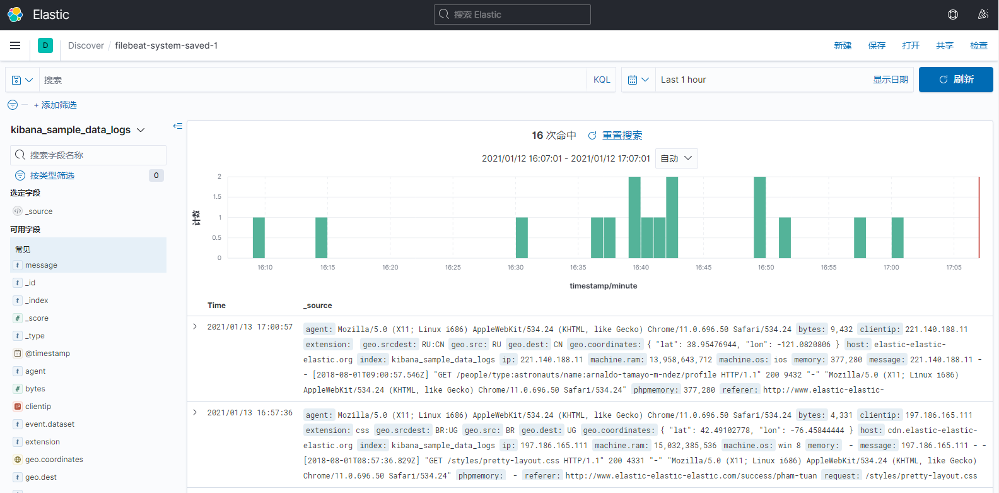

# ELK

：一套日志采集及展示方案，又称为 ELK Stack 或 Elastic Stack 。由 Elastic 公司发布。
- [官方文档](https://www.elastic.co/guide/index.html)
- [下载页面](https://www.elastic.co/cn/downloads/)

## 架构

ELk 系统主要用到以下软件：
- ElasticSearch
  - 用于存储数据，并支持查询。
- Logstash
  - 一个命令行工具，用于采集日志数据，并解析成格式化数据，发送到 ES 中存储。
  - 基于 Ruby 开发，通过 JRuby 解释器运行在 JVM 上。
- Kibana
  - 一个基于 node.js 运行的 Web 服务器，用于查询、展示 ES 中存储的数据。支持显示简单的仪表盘。

ELK 系统还可选择加入以下软件：
- Beats
  - 基于 Golang 开发，用于采集日志数据。比 Logstash 更轻量级，但功能较少。
- Elastic Agent
  - v7.8 版本新增的软件，用于采集日志数据。它集成了不同类型的 Beats 的功能。
- Observability
  - 为 Kibana 扩展了一些日志可视化的功能，比如实时查看日志、设置告警规则。
- Security
  - 用于监控一些安全事项。
- APM（Application Performance Monitoring）
  - 用于采集、监控应用程序的性能指标。
- Enterprise Search
  - 提供搜索功能，可以集成到业务网站的搜索栏中。

总结：
- 上述软件都是由 Elastic 公司开发。
- 部署时，ELk 系统中各个软件的版本应该尽量一致，否则可能不兼容。
- ELK 系统的收费版本称为 X-Pack ，增加了告警、安全、机器学习等功能。

## Kibana

### 部署

1. 下载二进制版：
    ```sh
    wget https://artifacts.elastic.co/downloads/kibana/kibana-7.10.1-linux-x86_64.tar.gz
    ```

2. 解压后，编辑配置文件 config/kibana.yml ：
    ```yml
    server.port: 5601           # Kibana 监听的端口
    server.host: '10.0.0.1'     # Kibana 监听的 IP

    elasticsearch.hosts: ['http://10.0.0.1:9200']   # 连接到 ES ，可以指定多个 host ，如果前一个不能访问则使用后一个
    # elasticsearch.username: 'admin'
    # elasticsearch.password: '123456'

    # kibana.index: '.kibana'   # 在 ES 中创建该索引，存储 Kibana 的数据

    i18n.locale: 'zh-CN'        # 让 Kibana 网站显示中文
    ```

3. 启动：
    ```sh
    bin/kibana
    ```

### 用法

- 访问 URL `/status` 可查看 Kibana 本身的状态。
- 除了使用 Logstash、Beats 等服务采集日志数据，还可以在 Kibana 网站上直接上传日志文件，解析后存储到 ES ，便于测试。

- 在 Kibana 的管理页面，可以查看、配置索引、数据流、索引模板、组建模板、索引模式。
- 建议在 Kibana 网站上进行以下设置：
  - 设置 Default 工作区，只显示 Kibana、Observability 中需要用到的部分功能，没必要显示 Enterprise Search、Security 等功能模块。
  - 将显示的日期格式设置为 `YYYY/MM/D HH:mm:ss` 。

<!--
- 上传日志文件时，配置 Grok 模式的语法？
- Kibana 查询语言的语法？
-->


### Discover

- Kibana 的 Discover 页面原本名为 Logs UI ，用于查询、查看日志。但现在扩展了用途，提供通用的 ES 可视化查询功能。
- 页面示例：

  

  - 页面上侧是搜索栏，默认使用 Kibana 查询表达式，支持设置时间范围。
  - 页面中央是一个时间轴，显示每个时刻命中的 document 数量。
  - 页面中下方是一个列表，显示所有查询结果。
    - 每行一条 document ，点击某个 document 左侧的下拉按钮，就会显示其详细信息。
    - 默认显示 Time 和 _source 字段，可以在左侧栏中指定其它字段用作显示。
  - 点击页面右上角的 Save 按钮，就会保存当前查询页面，以便日后再次查看。

### Fleet

- Kibana 的 Fleet 页面原本名为 Ingest Manager ，用于查看、配置 Elastic Agent 。


## Logstash

<!-- - 采集的每个日志称为一个日志事件（event）。 -->

<!-- 
### 部署

1. 下载二进制版：
    ```sh
    wget https://artifacts.elastic.co/downloads/logstash/logstash-7.10.1-linux-x86_64.tar.gz
    ```

2. 解压后，编辑配置文件 config/kibana.yml ：
    ```yml
    server.port: 5601           # Kibana 监听的端口
    server.host: '10.0.0.1'     # Kibana 监听的 IP

    elasticsearch.hosts: ['http://10.0.0.1:9200']   # 连接到 ES ，可以指定多个 host ，如果前一个不能访问则使用后一个
    # elasticsearch.username: 'admin'
    # elasticsearch.password: '123456'

    # kibana.index: '.kibana'   # 在 ES 中创建该索引，存储 Kibana 的数据

    i18n.locale: 'zh-CN'        # 让 Kibana 网站显示中文
    ```

3. 启动：
    ```sh
    bin/kibana
    ``` -->

### 配置

- Grok是Logstash过滤器的基础，广泛用于从非结构化数据中导出结构


## Beats

- Logstash 消耗内存较多，采集日志的效率较低，因此后来推出了 Beats 来取代 Logstash 。
  - 不过目前 Beats 不擅长解析日志文本。因此通常不让 Beats 直接将原始日志发送到 ES ，而是先发送给 Logstash 解析成结构化数据。
- 使用 Beats 时需要在每个要监控的主机上部署 Beats 进程，且监控不同类型的日志时需要部署不同的 beats 进程，比较麻烦。
- Beats 进程有多种类型，例如：
  - Filebeat ：用于采集日志文件。
  - Packetbeat ：用于采集网络数据包的日志。
  - Winlogbeat ：用于采集 Windows 的 event 日志。
  - Metricbeat ：用于采集系统或软件的性能指标。
  - Auditbeat ：用于采集 Linux Audit 进程的日志。
- Beats 采集日志数据之后，支持多种输出端：
  - ES
  - Logstash
  - Kafka
    - 比如日志的并发量太大时，可以将采集的数据先发送到 Kafka 消息队列，然后让 Logstash 从中拿取数据。
  - Redis
  - File
  - Console

### Filebeat

- Filebeat 的主要模块：
  - input ：输入端。
  - output ：输出端。
  - harvester ：收割机，负责采集日志。
- Filebeat 会对每个日志文件定期执行一个 harvester ，逐行读取日志文件，发送到输出端。
  - 开始读取时会打开文件描述符，读取结束之后才关闭文件描述符。
  - 读取时会记录日志文件的 inode ，以及当前读取的偏移量（bytes offset），从而避免重复采集日志。
    - 这些信息记录在 `data/registry/` 目录下的 registry 文件中。
- Filebeat 可以将采集的日志发送到 ES 或 Logstash 等输出端，但最终通常存储到 ES 中。
  - 同一个 Filebeat 进程采集的所有日志会存储到 ES 中同一个 index 之下。
  - 每条日志存储到 ES 中时，会加上一个 `@timestamp` 字段，表示当前时刻，但不一定是该日志产生的时刻。

#### 部署

1. 下载二进制版：
    ```sh
    wget https://artifacts.elastic.co/downloads/beats/filebeat/filebeat-7.10.1-linux-x86_64.tar.gz
    ```

2. 解压后，编辑配置文件 filebeat.yml ：
    ```yml
    setup.kibana:               # 关于 kibana 的配置
      host: '10.0.0.1:5601'

    output.elasticsearch:       # 关于输出到 ES 的配置
      hosts: ['10.0.0.1:9200']
      # username: 'admin'
      # password: '123456'
      # index: 'filebeat-%{[agent.version]}-%{+yyyy.MM.dd}-%{index_num}'   # 指定索引名。如果修改索引名，则还需要修改 setup.template.name 和 setup.template.pattern

    # output.logstash:          # 关于输出到 Logstash 的配置
    #   hosts: ['localhost:5044']
    ```

3. 启动：
    ```sh
    ./filebeat setup    # 连接到 Kibana 进行初始化，比如创建索引、仪表盘
    ./filebeat          # 在前台运行
              -e        # 将 filebeat 本身的输出发送到 stderr ，而不是已配置的 output
    ```

#### 配置

- 所有类型的 beats 都支持以下 General 配置项：
  ```yml
  name: 'filebeat-001'        # 该 Beat 的名称，默认使用当前主机名
  tags: ['json']              # 给每条日志加上标签，保存到一个名为 tags 的字段中，便于筛选日志
  fields:                     # 给每条日志加上字段，这些字段默认保存到一个名为 fields 的子字典中
    env: test
    level: debug
  fields_under_root: false    # 是否将 fields 的各个字段保存为日志的顶级字段，此时如果与已有字段重名则会覆盖
  ```

- 可以启用 filebeat 的一些内置模块，采集一些系统或流行软件的日志文件。
  - [模块列表](https://www.elastic.co/guide/en/beats/filebeat/current/filebeat-modules.html)
  - 例：
    ```sh
    ./filebeat modules enable system mysql nginx
    ```

- 可以在配置文件中让 filebeat 采集一些指定的日志文件：
  ```yml
  filebeat.inputs:                  # 关于输入项的配置
  - type: log                       # 定义一个输入项，类型为一般的日志文件
    paths:                          # 指定日志文件的路径
    - /var/log/mysql.log
    - '/var/log/nginx/*'            # 可以使用通配符

    # enabled: true                       # 是否启用该输入项
    # encoding: utf-8                     # 编码格式
    # exclude_files: ['\.tgz$']           # 排除一些文件，采用正则匹配
    # include_lines: ['^WARN', '^ERROR']  # 只采集日志文件中的指定行，采用正则匹配。默认采集所有非空的行
    # exclude_lines: ['^DEBUG', '^INFO']  # 排除日志文件中的指定行，采用正则匹配。该规则会在 include_lines 之后生效
    # max_bytes: 10485760                 # 每条日志文本的最大字节数，超过的部分不会采集。默认为 10 MB

    # 默认将每行视作一条日志，可以加入 multiline 配置项，将连续的多行文本视作同一条日志。multiline 规则会在 include_lines 之前生效
    # multiline.type: pattern       # 采用 pattern 方式，根据正则匹配处理多行。也可以采用 count 方式，根据指定行数处理多行
    # multiline.pattern: '^\s\s'    # 如果一行文本与 pattern 正则匹配，则按 match 规则与上一行或下一行合并
    # multiline.negate: false       # 是否反向匹配
    # multiline.match: after        # 取值为 after 则放到上一行之后，取值为 before 则放到下一行之前
    # multiline.max_lines: 500      # 多行日志最多包含多少行，超过的行数不会采集

    # 启用任何一个以 json 开头的配置项，就会将每条日志文本按 JSON 格式解析，解析的字段默认保存到一个名为 json 的子字典中
    # json.keys_under_root: true    # 是否将解析的字典保存为日志的顶级字段
    # json.add_error_key: true      # 如果解析出错，则加入 error.message 等字段

  - type: log
    paths:
      - '/var/log/apache2/*'
    fields:                         # 可以覆盖全局的 General 配置项
      apache: true
    fields_under_root: true

  - type: container                 # 采集容器的日志
    paths:
      - '/var/lib/docker/containers/*/*.log'
  ```


