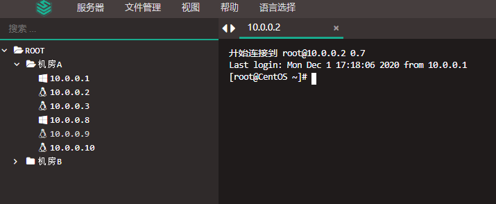

# Jumpserver

：一个 Web 服务器，实现了跳板机、堡垒机的功能，简称为 JMS 。
- [官方文档](https://docs.jumpserver.org/zh/master/)
- 由飞致云公司开源，基于 Python 的 Django 框架开发，于 2018 年发布 1.0 版本。

## 原理

### 功能

- 支持基于 SSH、Telnet、RDP、VNC 协议托管 Linux 或 Windows 主机，还可管理 Mysql 等应用。
- 连接 Linux 主机时会打开一个 WebSSH 窗口，连接 Windows 主机时会打开一个 GUI 窗口。
  - 支持 Ctrl+C 复制、Ctrl+V 粘贴等快捷键。
  - 支持基于 SFTP 协议上传、下载文件。
  - 基于 Ansible 批量管理主机，支持批量执行命令。

### 优点

- 便于批量管理主机的登录权限。
- 避免将主机的登录密码直接告诉用户。
- 用户可以通过跳板机连接到网络不能直达的主机。
- 提供了命令过滤、操作记录等功能，安全程度高。

### 缺点

- 存在单点故障的风险。JMS 挂掉时用户就不可以访问所有托管主机，JMS 被入侵时所有托管主机都有安全风险。
  - 不过可以分布式部署多实例，进行负载均衡，实现高可用。
- 与 SecureCRT 等专用的 SSH 客户端相比，功能较少。

### 主要模块

- Core ：核心组件，通过 Restful API 与其它模块交互。
- Coco ：一个采用 Python 开发的 SSH 客户端。目前已被 Koko 替换。
- Koko ：一个采用 Golang 开发的 SSH 客户端。
- Guacamole ：一个无客户端的远程桌面网关，由 Apache 开源。JMS 调用它来实现 RDP 功能。
- Luna ：用于渲染、输出前端文件。
- Nginx ：用于反向代理 Luna 。
- MySQL
- Redis
- Celery

## 部署

下载[官方脚本](https://github.com/jumpserver/installer)：
```sh
wget https://github.com/jumpserver/installer/releases/download/v2.9.1/jumpserver-installer-v2.9.1.tar.gz
```
解压后执行：
```sh
sh jmsctl.sh
              install     # 安装，下载 Docker 镜像，并提示用户进行一些配置
              uninstall   # 卸载
              upgrade     # 升级

              start
              stop
              status
```
- 部署时至少需要 4G 内存。
- 基于 docker-compose 启动。

## 配置

配置文件位于 `jumpserver/config/config.txt` 。部分内容示例：
```sh
HTTP_PORT=8080      # HTTP 端口，供用户通过浏览器访问 JMS
HTTPS_PORT=8443     # HTTPS 端口
SSH_PORT=2222       # SSH 端口，供用户通过 SSH 客户端访问 JMS
```
- 默认账号、密码为 admin、admin 。

## 用法

管理页面示例：


- 用户管理：用于管理 JMS 网站本身的用户。用户登录 JMS 之后，才可以跳转登录一些服务器。
- 资产管理
  - 资产列表：用于添加一些服务器作为资产，可以按树形结构分组。
  - 网域列表：用于添加 SSH 代理，使得 JMS 可以连接到某个网络的服务器。
  - 管理用户：指 JMS 通过 Ansible 批量登录服务器时采用的用户，获取硬件信息，还可以推送创建系统用户。
  - 系统用户：指通过 Web 终端登录服务器时采用的用户。
- 权限管理：用于控制 JMS 用户对哪些资产拥有访问权限。
  - 例如：
    1. 先添加一些服务器资产，分组节点为 “测试环境” 。并创建相应的管理用户、系统用户，都名为 “测试环境-管理员” 。
    2. 再创建一个名为 “测试环境-管理员” 的授权规则，将上述服务器的系统用户分配给某些 JMS 用户。
    3. 当 JMS 用户登录某个服务器时，如果有多个系统用户可用，则默认采用优先级最高的那个。如果优先级相同，则会弹出一个对话框供选择。
- 会话管理：
  - 会话管理：用于管理用户打开的 Web 终端，支持终断、实时监控、回放。
    - 会实时监控用户输入的每个字符，包括 Enter、Backspace、Ctrl+C 。
    - 连命令的终端输出也会监控。
  - 命令记录：用于记录用户在 Web 终端执行过的命令。
    - 不适合实时监控，存在一条命令的滞后。
    - 只会记录用户执行过的命令，不会记录用户输入的 Enter、Backspace、Ctrl+C 。
    - 记录命令的终端输出时，最多记录十几行。

Web 终端示例：


