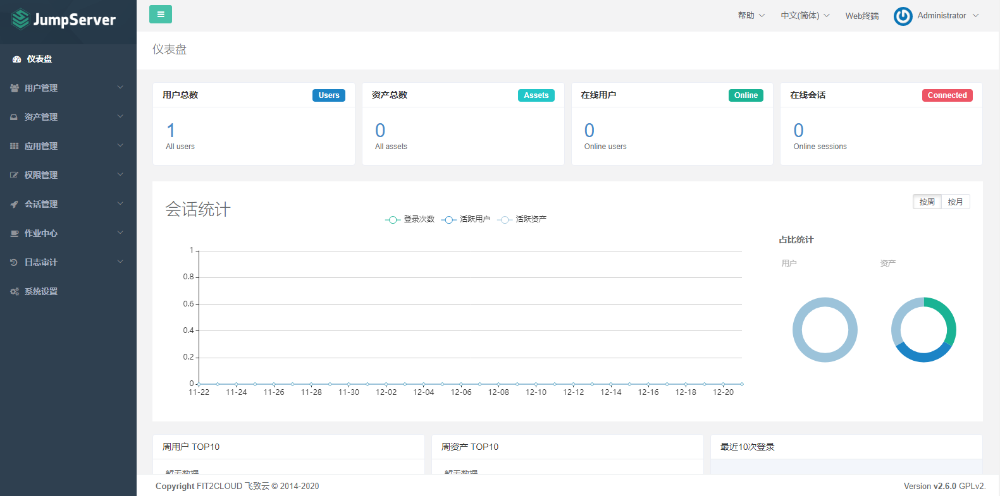

# Jumpserver

：一个跳板机系统，实现了堡垒机的功能。
- [官方文档](https://docs.jumpserver.org/zh/master/)
- 由飞致云公司开源，基于 Python 的 Django 框架开发，于 2018 年发布 1.0 版本。

## 原理

### 功能

- 支持基于 SSH、Telnet、RDP、VNC 协议托管 Linux 或 Windows 主机，还可管理 Mysql 等应用。
- 连接 Linux 主机时会打开一个 WebSSH 窗口，连接 Windows 主机时会打开一个 GUI 窗口，
- 支持基于 SFTP 协议上传、下载文件。
- 基于 Ansible 批量管理主机，支持批量执行命令。
- 支持分布式部署，实现高可用。

### 优点

- 便于集中控制主机的登录权限，可以实时管理权限。
- 避免将主机的登录密码直接告诉用户。
- 能记录用户的操作日志。
- 用户可以通过跳板机连接到网络不能直达的主机。

### 缺点

- 容易出现单点故障。跳板机挂掉时用户就不可以访问所有托管主机，跳板机被入侵时所有托管主机都有安全风险。
- 与有直接连接主机的专用客户端工具相比，功能可能不足。

### 主要模块

- Core ：核心组件，通过 Restful API 与其它模块交互。
- Coco ：基于 Python 开发的 SSH 客户端。目前已被 Koko 替换。
- Koko ：基于 Golang 开发的 SSH 客户端。
- Guacamole ：一个无客户端的远程桌面网关，由 Apache 开源。Jumpserver 调用它来实现 RDP 功能。
- Luna ：用于渲染、输出前端文件。
- Nginx ：用于反向代理 Luna 。
- MySQL
- Redis
- Celery

## 部署

- 下载[官方脚本](https://github.com/jumpserver/installer)：
  ```sh
  wget https://github.com/jumpserver/installer/releases/download/v2.6.0/jumpserver-installer-v2.6.0.tar.gz
  ```
  解压后执行：
  ```sh
  ./jmsctl.sh install     # 它会自动安装、部署，并提示用户进行一些配置
  ```
  - 部署主机至少需要 4G 内存。
  - 默认用 docker-compose 运行，监听 8080 端口。

## 用法

- 管理页面示例：

  

- Web 终端示例：

  

  - 使用 Web 终端时，不支持 Ctrl+C 复制快捷键，只能通过右键菜单复制。
