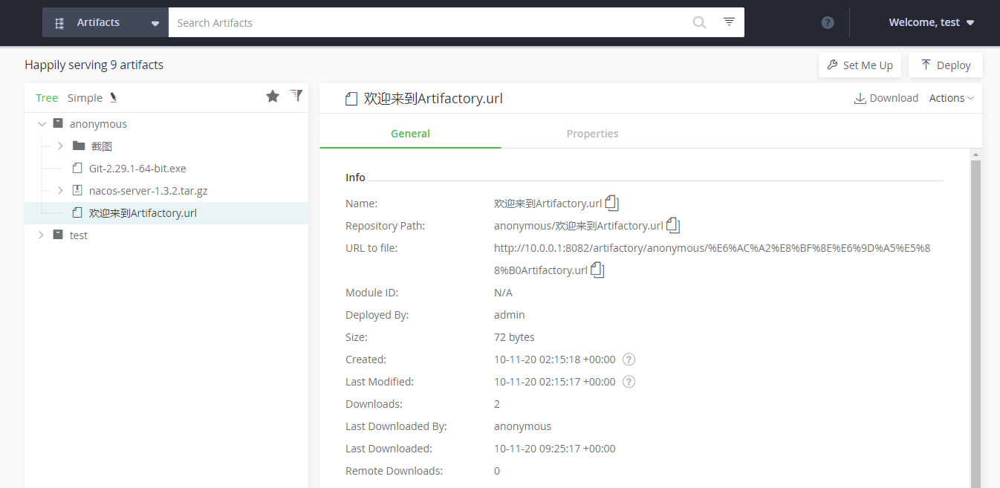

# Artifactory

：一个用作制品仓库的服务器软件，由 Jfrog 公司推出。
- 特定：
  - 提供了 Web 操作页面，也提供了上传、下载文件的 HTTP API 。
  - 社区版可以免费试用，但只能创建 Generic、Maven 等少量几种仓库。
  - 支持在 Web 页面上直接解压文件，进行预览。
- [官方文档](https://www.jfrog.com/confluence/display/RTF6X)
- 同类产品：
  - Nexus ：主要用作 Maven 仓库，用途较窄。

## 部署

- 运行 Docker 镜像：
  ```sh
  docker run -d --name artifactory -v /opt/artifactory:/var/opt/jfrog/artifactory -p 8082:8082 docker.bintray.io/jfrog/artifactory-oss
  ```
  默认用户名、密码为 admin、password 。

## 用法

Web 页面示例：



- 可以创建一个 Generic 类型的仓库，可用于直接保存文件，比如二进制文件。
- 在 Web 页面上，打开一个仓库，点击右上角的 "Deploy" 就会弹出一个上传文件的窗口。
- 上传文件时，需要指定它在该仓库中的保存路径。如果已存在该路径的文件，则会被覆盖。

## Restful API

- 上传文件：
  ```sh
  curl -X PUT -u admin:password http://10.0.0.1:8082/artifactory/generic_1/test/1.zip -T 1.zip
  ```

- 下载文件：
  ```sh
  curl -O -u admin:password http://10.0.0.1:8082/artifactory/generic_1/test/1.zip
  ```

- 删除文件：
  ```sh
  curl -X DELETE -u admin:password http://10.0.0.1:8082/artifactory/generic_1/test/1.zip
  ```
