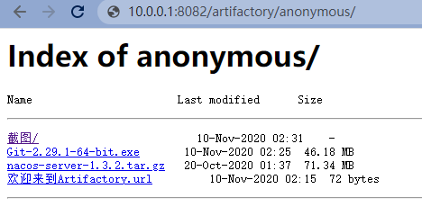

# Artifactory

：一个文件服务器，基于 HTTP 通信，常用于存储构建产物。
- [官方文档](https://www.jfrog.com/confluence/display/RTF6X)
- 由 Jfrog 公司推出，社区版可以免费使用，但功能较少。
- 可以通过浏览器访问，也可以生成文件的下载链接，通过 curl 命令上传、下载文件。
- 同类产品：
  - FTP 服务器：采用 FTP 协议传输数据，比 HTTP 协议的通用性低，且没有 Web 操作页面。
  - Nextcloud ：网盘，访问时需要使用浏览器或专用客户端。
  - Nexus ：主要用作 Maven 仓库，用途较窄。

## 部署

- 运行 Docker 镜像：
  ```sh
  docker run -d --name artifactory \
         -p 8082:8082 \
         -v /opt/artifactory:/var/opt/jfrog/artifactory \
         docker.bintray.io/jfrog/artifactory-oss
  ```
  默认用户名、密码为 admin、password 。

## 用法

- 管理员可以创建仓库（Repository），设置哪些用户有权向该仓库上传、下载文件。
- 仓库按存储位置分类：
  - 本地仓库(Local)
  - 远程仓库(Remote)：通过 URL 拉取其它仓库的内容，缓存到本地。
  - 虚拟仓库(Virtual)
- 仓库按文件格式分类：
  - Generic ：按二进制格式保存文件。
  - Maven
  - Gradle
- 默认定义了一个匿名用户（anonymous），代表没有登录的用户。
  - 可以在 Security -> Settings 页面中允许 “Allow Anonymous Access” 。

Web 页面如下：


- 在 Web 页面左侧，可选择一个仓库。点击右上角的 "Deploy" 就会弹出一个上传文件的窗口。
- 上传文件时，会根据文件名自动生成上传路径（Target Path）。
  - 如果已存在该路径的文件，则会覆盖它。
  - 可以主动设置上传路径，比如划分出子目录。
- 每个文件有一个唯一的 URL ，可供用户上传、下载该文件。
  - 文件的 URL 等于 ` 仓库 URL + 文件上传路径 ` 。可以从网页上拷贝该 URL ，也可以自己拼凑出来。
- 在浏览器上访问仓库或目录的 URL ，会显示基本的文件列表。如下：

  

节省存储空间的方法：
- Maven、Gradle 等类型的仓库，可以通过设置 “Max Unique Snapshots” 参数，只保留每个工件版本最大的 n 个快照（SNAPSHOT）。
- Artifactory Pro 版可以安装 artifactCleanup 插件，定时删除本地仓库中未使用的文件。
- Remote 类型的仓库可以通过设置 “Unused Artifacts Cleanup Period” 参数，将 n 小时未使用的缓存标记为 Unused 。然后在高级设置 Advanced -> Maintenance 页面，设置定时执行 “Cleanup Unused Cached Artifacts” 。

## Restful API

- 上传文件：
  ```sh
  curl -X PUT -u 用户名:密码 'http://10.0.0.1:8082/artifactory/anonymous/test/1.zip' -T 1.zip > /dev/null
  ```

- 下载文件：
  ```sh
  curl -O -u 用户名:密码 <URL>
  ```

- 删除文件：
  ```sh
  curl -X DELETE -u 用户名:密码 <URL>
  ```
