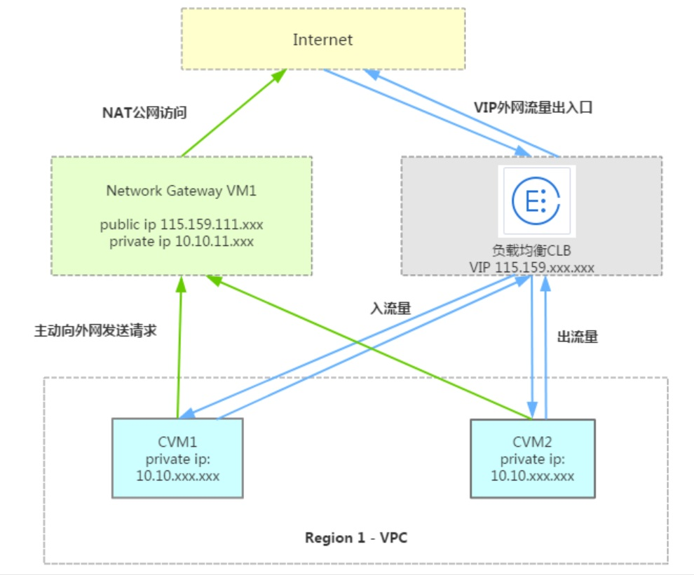

# 云计算

- 2006 年，亚马逊公司推出云服务 EC2、S3 ，开启了云计算时代，此后出现了许多提供云服务的公司。
  - 在传统模式下，用户想部署一个 Web 网站时，需要自己购买服务器裸机，然后安装操作系统、Web 服务器、依赖软件。
  - 在云计算时代，用户可以直接使用云服务商提供的 Web、数据库等服务器，省掉一些亲自动手的工作量。

## 服务模式

云计算的服务模式包括：
- IaaS ：基础设施即服务（Infrastructure as a Service），云端提供一些基础设施供用户使用，比如服务器裸机。
- Paas ：平台即服务（Platform as a Service），云端提供平台资源供用户使用，比如 Linux 服务器、硬盘。
- SaaS ：软件即服务（Software as a Service），云端提供一些软件供用户使用，比如给开发者提供已部署的 MySQL、Nginx ，给普通用户提供电商网站。
- BaaS ：后端即服务（Backend as a Service），云端提供一些后端服务供用户使用，比如数据库、对象存储。
- FaaS ：函数即服务（Function as a Service），云端直接运行用户编写的代码，不需要用户构建、部署。
  - 比如云端提供一些部署在容器中的前端模板项目、Python 模板项目，允许用户修改其中的代码。

## 相关概念

- VPS（Virtual Private Servers ，虚拟专用服务器）
  - ：又称为虚拟机。可以在一台物理服务器上通过 Hypervisor 技术运行多个虚拟服务器，分配给多个用户私自使用。
- CVM（Cloud Virtual Machine ，云虚拟机）
  - ：指云平台提供的 VPS 。
  - 有的云平台将它称为 ECS（Elastic Compute Service ，弹性计算服务器）。
- VPC（Virtual Private Cloud ，虚拟私有云）
  - ：云平台上一种小的逻辑分区，管理一组 VPS ，专门供某个用户或企业使用，像一个 Paas 层的私有云。
- VDC（Virtual Data Center ，虚拟数据中心）
  - ：云平台上一种大的逻辑分区，管理一组 VPS、CPU、内存、硬盘等资源，像一个 IaaS 层的私有云。
- OpenStack
  - ：一个开源的云平台框架，采用 Python 开发，常用于搭建云平台并管理服务器等资源，提供 IaaS 服务。
- 云原生（Cloud Native）
  - ：将软件的开发、测试、运维等过程都迁移到云平台上进行，充分利用云平台的优势。
- Serverless
  - ：一种设计模式，又称为无服务器架构。是让软件开发人员专注于代码开发，不必关注在服务器上如何构建、部署、运维。
  - 云计算的 BaaS 和 FaaS 都属于 Serverless 。
  - 例如微信小程序实现了 Serverless ，开发者写好代码之后就可以直接发布。

## VPC 组网

- 一个 VPC 中包含的各个 VPS ，默认位于同一个局域网，可以使用内网 IP 相互通信。
  - 不同 VPC 之间网络隔离，需要添加路由表才能相互通信。
  - 一个 VPC 中还可以划分多个子网，但这些子网之间并没有网络隔离。
- 安全组：相当于防火墙规则，用于控制主机的出入流量。
  - 主机的出入流量先受到主机上 firewalld 防火墙的控制，再受到云平台安全组的控制。
  - 可以给一个或多个 VPS 绑定一个或多个安全组。

VPC 内部的主机与外部通信的方法：
- 可以给 VPC 添加 NAT 网关，让 VPC 能与公网通信。此时网络包的流向为：VPC 主机 → NAT 网关 → 公网主机 。
- 可以给 VPC 添加 VPN ，让 VPC 能与本地网络通信。此时网络包的流向为：VPC 主机 → VPC 网关 → 公网中转 → VPN 服务器 → 公网中转 → 本地网关 → 本地主机 。
- 可以给 VPC 中的一个主机绑定外部某个网络的 IP ，使其能够与该网络的主机通信。这个 IP 在不用的时候可以解绑，因此称为 "弹性 IP" 。
  - 例如，使用弹性公网 IP ，就可以让 VPC 中的主机与公网通信。
  - 一个弹性 IP 只能让 VPC 中的一个主机与外部通信，而一个 NAT 网关可以让 VPC 中的所有主机与外部通信。
  - 如果将一个弹性公网 IP 给 NAT 网关使用，就可以让 VPC 中的所有主机都能访问公网。

下图是腾讯云的网络架构：

- CVM 部署在 region1 的 VPC 中，不具备公网 IP ，不能主动与公网通信，对外网不可见。
- 当公网中的主机主动访问集群时，要将请求发送到 LBS 的公网 IP 地址、80 端口。
  - LBS 会将从 80 端口收到的流量转发给 VPC 中的几个 CVM——将数据包的目的 IP、目的端口改为某台 CVM 的内网 IP、端口。CVM 收到该包之后，会把它转发到相应的容器端口。
  - 当 CVM 处理完请求之后，会将回复的数据包通过 LBS 返回给公网的主机。
- 当 CVM 主动访问公网时，要将请求发送到 NAT 网关，由 NAT 网关进行代理。
- 当 CVM1 主动访问同一个 VPC 内的另一个 CVM2 时，需要先配置从 CVM1 到 CVM2 的路由表。
- 当 CVM1 主动访问另一个 VPC 内的 CVM 时，需要先通过 "对等连接" 功能将两个 VPC 的网络连通，然后配置两个 VPC 之间的路由表。
- 在腾讯云购买一个 VPS 之后，如果需要连通公网，有两种计费模式：
  - 按带宽计费 ：限制公网出带宽的最大值，即 VPS 发向公网的流量。
    - 公网入带宽与公网出带宽相等，但至少会分配 10 Mbps ，因为能共享机房的入带宽。
  - 按流量计费 ：每隔一个小时，按实际使用的公网出流量计费。
