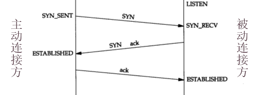
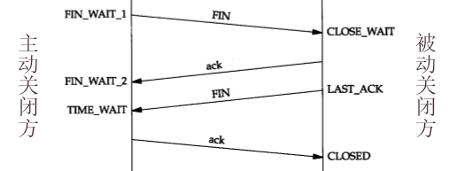

# Socket

：套接字。是一种在内存中创建的文件描述符，并不会实际存储在磁盘上。
- 使用 Socket ，程序可以用读写文件的方式进行进程间通信。主要有两种用法：
  - Unix Domain Socket ：用于本机的进程之间通信，保存为一个 Socket 文件，比如 /var/lib/mysql/mysql.sock 。
  - Network Socket ：用于不同主机的进程之间通信，基于 TCP/UDP 协议通信，用 host:port 表示通信方。

## TCP

### Socket 状态

- 建立 TCP 连接时的 Socket 状态变化：

  

  - `LISTEN`      ：server 正在监听该 Socket ，允许接收 TCP 包。
  - `SYN_SENT`    ：client 已发出 SYN=1 的 TCP 包，还没有收到 SYN+ACK 包。
  - `SYN_RECV`    ：server 已收到 SYN 包，还没有收到 ACK 包。
    - 如果 server 一直未收到 ACK 包，则会在超时之后重新发送 SYN+ACK 包，再次等待。多次超时之后，server 会关闭该连接。
  - `ESTABLISHED` ：已建立连接。

- 断开 TCP 连接时的 Socket 状态变化：

  

  - `FIN-WAIT-1`
  - `FIN-WAIT-2`
  - `TIME_WAIT`
    - 主动关闭方在关闭连接之后，还要等待 2*MSL 时间之后才能变成 CLOSED 状态，避免对方来不及关闭连接。此时该端口占用的资源不会被内核释放。
    - MSL（Maximum Segment Lifetime）：TCP 段在网络传输中的最大生存时间，超过该时间就会被丢弃。它的默认值为 2 分钟。
    - 一般 HTTP 通信时，服务器发出响应报文之后就会主动关闭连接（除非是长连接），使端口变成 TIME_WAIT 状态。
    - 如果服务器处理大部分 HTTP 请求的时长，都远低于 TIME_WAIT 时长，就容易产生大量 TIME_WAIT 状态的端口，影响并发性能。
  - `CLOSE_WAIT`
    - 例如：HTTP 客户端发送 FIN 包来主动关闭连接时，HTTP 服务器没有马上调用 close() 关闭端口，就会长时间处于 CLOSE_WAIT 状态。
  - `LAST_ACK`
  - `CLOSED` ：已关闭连接。

### 连接队列

- 建立 TCP 连接时，server 方的内核会为每个 Socket 维护 SYN、accept 两个连接队列。
  - 当连接变为 SYN_RECV 状态时，将连接信息存入 SYN 队列，又称为半连接队列。
    - 此时每个连接占用 304 bytes 内存。
    - 查看半连接的数量：
      ```sh
      netstat | grep SYN_RECV | wc -l
      ```
  - 当连接变为 ESTABLISHED 状态时，将它从 SYN 队列取出，存入 accept 队列，又称为全连接队列。
    - 然后等待进程主动调用 accept() 函数，取出连接。

- 当队列满了时，Socket 不能接收新连接。
  - 内核默认会在 SYN 队列满了时启用 SYN Cookies 功能，从而抵抗 SYN Flood 攻击。
    - 原理：将 SYN_RECV 状态的连接信息不存入 SYN 队列，而是在 server 回复的 SYN+ACK 包中包含一个 cookie 信息。client 之后发出 ACK 包时如果包含该 cookie ，则允许建立连接。
    - 该功能不符合 TCP 协议，与某些服务不兼容。

### 常见报错

- 当主机 A 向主机 B 的某个端口发送 SYN 包，请求建立 TCP 连接时：
  - 如果主机 B 的防火墙禁用了该端口，则会拒绝通信，导致主机 A 报错：`No route to host`
    - 防火墙也可能丢弃该包，不作出响应，导致主机 A 长时间停留在尝试连接的阶段，显示：`Trying <host>...`
    - 如果主机 A 长时间没有收到回复（连 RST 包都没收到），则超出等待时间之后会报错：`Connection timed out`
  - 如果主机 B 的防火墙放通了该端口，但没有进程在监听该 socket ，则会回复一个 RST 包，表示拒绝连接，导致主机 A 报错：`Connection refused`

- 当主机 A 与主机 B 通信过程中，主机 B 突然断开 TCP 连接时：
  - 如果主机 A 继续读取数据包，主机 B 就会回复一个 RST 包，导致主机 A 报错：`Connection reset`
  - 如果主机 A 继续发送数据包，主机 B 就会回复一个 RST 包，导致主机 A 报错：`Connection reset by peer`

## 相关 API

### 创建 Socket

- 创建 Socket 的 API ：
  ```c
  #include <sys/socket.h>

  // 创建一个 Socket ，输入的参数用于指定协议、类型，返回一个文件描述符 sockfd
  int socket(int domain, int type, int protocol);

  // 将一个 Socket 绑定到指定的 IP 地址和 port 端口
  int bind(int sockfd, const struct sockaddr *addr, socklen_t addrlen);

  // 让 Socket 进入 Listen 状态（常被作为服务器的进程调用）
  int listen(int sockfd, int backlog);
      // backlog ：accept 队列的最大长度。该值的隐式最大值为 net.core.somaxconn

  // 连接到指定 Socket（常被作为客户端的进程调用）
  int connect(int sockfd, const struct sockaddr *addr, socklen_t addrlen);

  // 从指定 Socket的 accept 队列取出一个 TCP 握手成功的连接，为它创建并绑定一个新 Socket ，返回新的 sockfd
  // 源 Socket 为 Listen 状态，新 Socket 为 ESTABLISHED 状态
  // 如果 accept 队列为空，则一直阻塞等待
  int accept(int sockfd, struct sockaddr *restrict addr, socklen_t *restrict addrlen);
    // addr    ：请求连接的客户端地址
    // addrlen ：客户端地址的长度，即 sizeof(addr)

  // 用于停止 Socket 的通信（但并没有关闭 Socket ）
  int shutdown(int sockfd , int how);
      // how ：表示操作类型，可取值：
        // SHUT_RD   ：停止接收，并丢弃接收缓冲区中的数据
        // SHUT_WR   ：停止发送，但继续传输发送缓冲区中的数据
        // SHUT_RDWR ：停止接收和发送
  ```

- TCP 服务器的通信流程示例：
  1. 调用 socket() 创建 Socket ，然后用 bind() 绑定，用 listen() 监听，等待客户端建立 TCP 连接。
  2. 调用 accept() ，接收客户端的连接。
  3. 调用 read()、write() 读写 Socket 。
  4. 调用 close() 关闭 Socket 。

- 每个 Socket 连接由五元组 protocol、src_addr、src_port、dst_addr、dst_port 确定，只要其中一项元素不同， Socket 的文件描述符就不同。
  - 当服务器监听一个 TCP 端口时，可以被任意 dst_addr、dst_port 连接，因此建立的 Socket 连接有 255^4 * 65535 种可能性。
  - 实际上，一个主机上建立的 Socket 连接数一般最多为几万个，主要受以下因素限制：
    - 进程允许打开的文件描述符总数
    - 内存总量

- Linux 收到一个发向本机的 TCP/UDP 数据包时，先检查其目标 IP 、目标端口，判断属于哪个 Socket ，然后交给监听该 Socket 的进程。
  - 如果不存在该 Socket ，则回复一个 RST 包，表示拒绝连接。
  - 如果一个进程调用 bind() 时，该端口已被其它进程绑定，则会报错：`bind() failed: Address already in use`
  - 如果一个进程绑定 IP 为 127.0.0.1 并监听，则只会收到本机发来的数据包，因为其它主机发来的数据包的目标 IP 不可能是本机环回地址。
  - 如果一个进程绑定 IP 为 0.0.0.0 并监听，则会收到所有目标 IP 的数据包，只要目标端口一致。

### 读写 Socket

- 关闭、读写 Socket 的 API ，与普通文件一致：
  ```c
  #include <unistd.h>

  int close(int fd);
  ssize_t read(int fd, void *buf, size_t count);
  ssize_t write(int fd, const void *buf, size_t count);
  ```

- 关闭 Socket 的几种方式：
  - 等创建该 Socket 的进程主动调用 close() 。
    - 其它进程不允许关闭，即使是 root 用户。
  - 终止创建该 Socket 的进程，内核会自动回收其创建的所有 Socket 。
  - 通过 gdb ，调试创建该 Socket 的进程，调用 close() 。如下：
    ```sh
    ss -tapn | grep $PORT     # 找出监听某个端口的进程的 PID
    lsof -p $PID | grep TCP   # 找出该进程创建的 Socket 的文件描述符 FD
    gdb  -p $PID              # 调试该进程
    call close($FD)           # 关闭 Socket
    ```

## 相关命令

### sockstat

查看各状态的 socket 数量：
```sh
[CentOS ~]# cat /proc/net/sockstat
sockets: used 1101
TCP: inuse 44 orphan 0 tw 260 alloc 402 mem 37
UDP: inuse 2 mem 10
UDPLITE: inuse 0
RAW: inuse 0
FRAG: inuse 0 memory 0
```
- `used` ：使用的 socket 数量。
- `inuse` ：监听的 socket 数量。
- `orphan` ：无主的，不属于任何进程。
- `tw` ：time_wait 。
- `alloc` ：allocated ，已分配的。
- `mem` ：内存中缓冲区的大小，单位未知。

### telnet

：一个传统的远程登录工具。
- 通信内容没有加密，容易被监听。因此现在不适合用于远程登录，常用于测试 TCP 端口能否连通。
- 命令：
  ```sh
  $ telnet <host> [port]    # 连接到某个主机（默认采用 TCP 23 端口）
  ```

- 例：端口连通
  ```sh
  [root@Centos ~]# telnet baidu.com 80
  Trying 39.156.69.79...
  Connected to baidu.com.
  Escape character is '^]'.

  ```
  - 可见它成功连接到目标主机的 80 端口。此时按 `Ctrl+]` 加 `Ctrl+D` 即可断开连接。

- 例：端口不通
  ```sh
  [root@Centos ~]# telnet 127.0.0.1 8000
  Trying 127.0.0.1...
  telnet: connect to address 127.0.0.1: Connection refused
  ```

- 例：无响应
  ```sh
  [root@Centos ~]# telnet baidu.com
  Trying 220.181.38.148...

  ^C
  ```
  - 可见它一直尝试连接目标主机的 23 端口，但并没有收到响应。原因可能是：
    - 与目标主机的网络不通。
    - 与目标主机的网络连通，但防火墙禁止了该端口的流量。
    - 与目标主机的端口连通，但是目标主机的 CPU 或内存等资源已经耗尽，不能做出响应。

### netstat

：用于查看本机网络连接的状态。
- 命令：
  ```sh
  $ netstat
          -a  # 显示所有 socket
          -l  # 只显示被进程 listen 的 socket
          -t  # 只显示 TCP 的 socket
          -u  # 只显示 UDP 的 socket
          -x  # 只显示 unix socket

          -e  # 增加显示 User、Inode 列
          -p  # 增加显示 PID/Program name 列，表示使用每个 socket 的进程
          -n  # 不允许用服务名代替端口号（比如默认会把 22 端口显示成 ssh）
  ```

### ss

：socket statistics ，用于查看本机 socket 的状态。
- 与 netstat 命令类似，但运行速度更快。
- 命令：
  ```sh
  $ ss        # 显示 established 状态的 socket
      -a      # 显示所有状态的 socket
      -l      # 只显示被进程 listen 的 socket
      -t      # 只显示 TCP 的 socket
      -u      # 只显示 UDP 的 socket
      -x      # 只显示 unix socket

      -p      # 显示使用每个 socket 的进程名
      -n      # 不允许用服务名代替端口号

      -s      # 只显示各种 Socket 的统计数量
  ```

- 例：查看所有 TCP 端口的信息
  ```sh
  [root@Centos ~]# ss -tapn | cat    # 加上 cat 使显示的 users 列不换行
  State      Recv-Q Send-Q Local Address:Port    Peer Address:Port
  LISTEN     0      128    127.0.0.1:34186            *:*              users:(("node",pid=15647,fd=19))
  LISTEN     0      128        *:111                  *:*              users:(("systemd",pid=1,fd=51))
  LISTEN     0      128        *:22                   *:*              users:(("sshd",pid=3057,fd=3))
  ```
  - 不指定 Socket 类型时，默认显示的第一列是 `Netid` ，表示 Socket 类型，取值包括：
    ```sh
    TCP
    UDP
    u_str     # Unix Stream
    u_dgr     # UNIX datagram
    nl        # net link
    p_raw     # raw packet
    p_dgr     # datagram packet
    ```
  - LISTEN 状态时：
    - Recv-Q 表示当前 accept 队列的长度。
    - Send-Q 表示 accept 队列允许的最大长度。
  - 非 LISTEN 状态时：
    - Recv-Q 表示已接收、尚未被进程读取的字节数。
    - Send-Q 表示已发送、尚未收到对方 ACK 的字节数。
    - 上述两个值为 0 时最好，说明内核缓冲区没有堆积。
  - 最右端的一列 users 表示监听每个端口的进程。

- 例：查看各种 Socket 的统计数量
  ```sh
  [root@Centos ~]# ss -s
  Total: 1101 (kernel 1405)           # Total 表示存在的 Socket 数。不过 kernel 中存在的 Socket 数较多一些，因为有些 Socket 已关闭，但尚未回收
  TCP:   697 (estab 140, closed 538, orphaned 0, synrecv 0, timewait 295/0), ports 0

  Transport Total     IP        IPv6
  *         1405      -         -
  RAW       0         0         0
  UDP       3         2         1     # 统计 UDP 类型的 Socket ，包括总数、IPv4 数量、IPv6 数量
  TCP       159       44        115
  INET      162       46        116
  FRAG      0         0         0
  ```
  - 执行 `ss -a` 时不会显示 closed 状态的 Socket ，但它们的确存在，占用了文件描述符。
  - 这里 closed 状态的 Socket ，不是指被 close() 关闭的 Socket （它们会被内核回收），而是指没有通信的 Socket 。比如：
    - 程序创建 Socket 之后，没有成功调用 connect() ，导致该 Socket 从未进行通信。
    - 程序调用了 shutdown() ，但没有调用 close() ，导致该 Socket 停止通信。

### tcpdump

：一个网络抓包工具，可以抓取主机网卡上收发的所有数据包。
- 命令：
  ```sh
  tcpdump
          -i lo         # 监听指定网卡（默认是监听第一个网卡，即 eth0）
          -n            # 将主机名、域名显示成明确的 IP 地址
          -nn           # 将端口名显示成明确的端口号
          -v            # 显示数据包的详细信息
          -vv           # 显示数据包更详细的信息

          # 过滤表达式
          host 10.0.0.1       # 指定主机
          net 10.0.0.1/24     # 某个网段
          src 10.0.0.1        # 指定源地址
          dst 10.0.0.1        # 指定目的地址
          tcp                 # 指定协议
          port 80             # 指定端口
          tcp and dst port 80 # 过滤出目的端口为 80 的 tcp 数据包

          -c 10               # 抓取指定数量的数据包之后就停止运行
          -w dumps.pcap       # 将抓取信息保存到一个文件中
  ```
  - 监听 eth0 网卡时，会抓取本机与其它主机通信的数据包。监听 lo 网卡时，会抓取本机内部通信的数据包。
  - 过滤表达式支持使用 and、or、not 运算符。
  - 可以先用 tcpdump 抓包并保存为文件，然后在 Wireshark 的 GUI 界面中分析。

- 下例是对一次 HTTP 请求的抓包：
  ```sh
  [root@Centos ~]# tcpdump -nn tcp and dst port 8000
  tcpdump: verbose output suppressed, use -v or -vv for full protocol decode
  listening on eth0, link-type EN10MB (Ethernet), capture size 262144 bytes
  13:46:14.669786 IP 10.124.128.97.52152 > 10.124.130.12.8000: Flags [S], seq 2920488928, win 29200, options [mss 1424,sackOK,TS val 3983484990 ecr 0,nop,wscale 7], length 0
  13:46:14.670038 IP 10.124.128.97.52152 > 10.124.130.12.8000: Flags [.], ack 174830516, win 229, options [nop,nop,TS val 3983484990 ecr 2392282894], length 0
  13:46:14.670095 IP 10.124.128.97.52152 > 10.124.130.12.8000: Flags [P.], seq 0:82, ack 1, win 229, options [nop,nop,TS val 3983484990 ecr 2392282894], length 82
  13:46:14.672466 IP 10.124.128.97.52152 > 10.124.130.12.8000: Flags [.], ack 18, win 229, options [nop,nop,TS val 3983484992 ecr 2392282896], length 0
  13:46:14.672591 IP 10.124.128.97.52152 > 10.124.130.12.8000: Flags [.], ack 378, win 237, options [nop,nop,TS val 3983484992 ecr 2392282897], length 0
  13:46:14.672667 IP 10.124.128.97.52152 > 10.124.130.12.8000: Flags [F.], seq 82, ack 378, win 237, options [nop,nop,TS val 3983484993 ecr 2392282897], length 0
  13:46:14.672805 IP 10.124.128.97.52152 > 10.124.130.12.8000: Flags [.], ack 379, win 237, options [nop,nop,TS val 3983484993 ecr 2392282897], length 0
  ```
  - 每行包含多个字段：时间戳 源地址 > 目的地址 Flags ... length
  - 常见的几种 TCP 数据包标志：
    ```sh
    [S]     # SYN 数据包
    [.]     # ACK 数据包
    [S.]    # SYN+ACK 数据包
    [P]     # PUSH 数据包
    [F]     # FIN 数据包
    [R]     # RST 数据包
    ```
