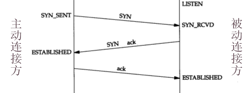

# TCP/UDP

## Socket 通信状态

建立 TCP 连接时：


- `SYN_SENT` ：已发出 SYN=1 的 TCP 包，还没有收到 ACK=1、SYN=1 的 TCP 包。
- `SYN_RECEIVED`
- `ESTABLISHED` ：已建立连接，可以通信。
- `LISTEN` ：该 Socket 已绑定到某个进程，内核正在监听该 Socket 。


断开 TCP 连接时：


- `FIN-WAIT-1`
- `FIN-WAIT-2`
- `TIME_WAIT`
  - 主动关闭方在关闭连接之后，还要等待 2*MSL 时间之后才能变成 CLOSED 状态，避免对方来不及关闭连接。此时该端口占用的资源不会被内核释放。
  - MSL（Maximum Segment Lifetime）：TCP 段在网络传输中的最大生存时间，超过该时间就会被丢弃。它的默认值为 2 分钟。
  - 一般 HTTP 通信时，服务器发出响应报文之后就会主动关闭连接（除非是长连接），使端口变成 TIME_WAIT 状态。
  - 如果服务器处理大部分 HTTP 请求的时长，都远低于 TIME_WAIT 时长，就容易产生大量 TIME_WAIT 状态的端口，影响并发性能。
- `CLOSE_WAIT`
  - 例如：HTTP 客户端发送 FIN 包来主动关闭连接时，HTTP 服务器没有马上调用 close() 关闭端口，就会长时间处于 CLOSE_WAIT 状态。
- `LAST_ACK`
- `CLOSED` ：已关闭连接。


## sockstat

在 Linux 上，执行以下命令可查看各状态的 socket 数量：
```
[CentOS ~]# cat /proc/net/sockstat
sockets: used 375
TCP: inuse 38 orphan 0 tw 34 alloc 150 mem 6
UDP: inuse 0 mem 2
UDPLITE: inuse 0
RAW: inuse 0
FRAG: inuse 0 memory 0
```
- `sockets: used` ：已使用的 socket 数量。
- `TCP: inuse` ：正在使用的 TCP socket 数量。
  - `orphan` ：无主的，不属于任何进程。
  - `tw` ：等待关闭的。
  - `alloc` ：已分配的。
  - `mem` ：使用的缓存大小。

## TCP 常见报错

- 当主机 A 向主机 B 的某个端口发送 SYN 包，请求建立 TCP 连接时：
  - 如果主机 B 的防火墙禁用了该端口，或者启用了该端口但是没有进程在监听该端口，主机 B 的内核就会回复一个 RST 包（也可能一直不回复），导致主机 A 报错：`Connection refused`
  - 如果主机 A 一直没有收到回复（连 RST 包都没收到），则超出等待时间之后会报错：`Connection timed out`

- 当主机 A 与主机 B 通信过程中，主机 B 突然断开 TCP 连接时：
  - 如果主机 A 继续读取数据包，主机 B 就会回复一个 RST 包，导致主机 A 报错：`Connection reset`
  - 如果主机 A 继续发送数据包，主机 B 就会回复一个 RST 包，导致主机 A 报错：`Connection reset by peer`

## telnet

：一个传统的远程登录工具。
- 通信内容没有加密，容易被监听。因此不再适合用于远程登录，现在常用于测试 TCP 端口是否连通。
- 命令：
    ```sh
    $ telnet <host> [port]    # 连接到某个主机的 TCP 端口（默认是 23 端口）
    ```

- 例：端口连通
    ```
    [root@Centos ~]# telnet baidu.com 80
    Trying 39.156.69.79...
    Connected to baidu.com.
    Escape character is '^]'.

    ```
    - 可见它成功连接到目标主机的 80 端口。此时按 `Ctrl+]` 和 `Ctrl+D` 即可断开连接。

- 例：端口不连通
    ```
    [root@Centos ~]# telnet 127.0.0.1 8000
    Trying 127.0.0.1...
    telnet: connect to address 127.0.0.1: Connection refused
    ```
    - Connection refused 表示与目标主机的物理网络连通，但是连接不到目标端口。原因可能是：
      - 目标主机的防火墙拦截了发向该端口的数据包。
      - 目标主机的防火墙开通了该端口，但是目标主机上没有进程在监听该端口。
    - 上方访问的目标主机是本地环回地址，不会被防火墙拦截，所以是第二种原因。

- 例：无响应
    ```
    [root@Centos ~]# telnet baidu.com
    Trying 220.181.38.148...

    ^C
    ```
    - 可见它一直尝试连接目标主机的 23 端口，但并没有成功。原因可能是：
      - 与目标主机的网络不通
      - 端口无响应

## netstat

：用于查看本机网络连接的状态。

<details>
<summary>已淘汰不用</summary>

命令：

```sh
$ netstat
        -a  # 显示所有网络连接、socket
        -l  # 只显示 LISTEN 状态的
        -t  # 只显示 tcp 的 socket
        -u  # 只显示 udp 的 socket
        -x  # 只显示 unix socket
        -p  # 显示使用每个网络连接的进程名
```

</details>

## ss

：socket statistics ，用于查看 socket 的统计信息。
- 与 netstat 命令类似，但运行速度更快。

- 命令：
    ```sh
    $ ss        # 显示 established 状态的 socket
        -a      # 显示所有状态的 socket
        -l      # 只显示被进程 listen 的 socket
        -t      # 只显示 TCP 协议的端口
        -u      # 只显示 UDP 协议的端口
        -x      # 只显示本机通信的 socket

        -p      # 显示使用每个 socket 的进程名
        -n      # 不允许用服务名代替端口号（比如默认会把 22 端口显示成 ssh）
        -s      # 增加显示 TCP、UDP 等类型端口的统计信息
    ```

- 例：查看所有 TCP 端口的信息
    ```
    [root@Centos ~]# ss -tapn | cat    # 加上 cat 使显示的 users 不换行
    State      Recv-Q Send-Q Local Address:Port    Peer Address:Port
    LISTEN     0      128    127.0.0.1:34186            *:*              users:(("node",pid=15647,fd=19))
    LISTEN     0      128        *:111                  *:*              users:(("systemd",pid=1,fd=51))
    LISTEN     0      128        *:22                   *:*              users:(("sshd",pid=3057,fd=3))
    ```
    - Recv-Q、Send-Q ：表示接收队列、发送队列中待处理的数据包数。它们最好为 0 ，即没有包堆积。
    - 最右端的一列 users 表示监听每个端口的进程。

- 例：查看指定端口的信息
    ```
    [root@Centos ~]# ss -tapn | grep 8000
    LISTEN     0      128         :::8000               :::*             users:(("docker-proxy",pid=18614,fd=4))
    ```

## tcpdump

：一个网络抓包工具，可以抓取主机网卡上收发的所有数据包。
- 命令：
    ```sh
    tcpdump
            -i lo         # 监听指定网卡（默认是监听第一个网卡，即 eth0）
            -n            # 将主机名、域名显示成明确的 IP 地址
            -nn           # 将端口名显示成明确的端口号
            -v            # 显示数据包的详细信息
            -vv           # 显示数据包更详细的信息

            # 过滤表达式
            host 10.0.0.1       # 指定主机
            net 10.0.0.1/24     # 某个网段
            src 10.0.0.1        # 指定源地址
            dst 10.0.0.1        # 指定目的地址
            tcp                 # 指定协议
            port 80             # 指定端口
            tcp and dst port 80 # 过滤出目的端口为 80 的 tcp 数据包

            -c 10               # 抓取指定数量的数据包之后就停止运行
            -w dumps.pcap       # 将抓取信息保存到一个文件中
    ```
    - 监听 eth0 网卡时，会抓取本机与其它主机通信的数据包。监听 lo 网卡时，会抓取本机内部通信的数据包。
    - 过滤表达式支持使用 and、or、not 运算符。
    - 可以先用 tcpdump 抓包并保存为文件，然后在 Wireshark 的 GUI 界面中分析。

- 下例是对一次 HTTP 请求的抓包：
    ```sh
    [root@Centos ~]# tcpdump -nn tcp and dst port 8000
    tcpdump: verbose output suppressed, use -v or -vv for full protocol decode
    listening on eth0, link-type EN10MB (Ethernet), capture size 262144 bytes
    13:46:14.669786 IP 10.124.128.97.52152 > 10.124.130.12.8000: Flags [S], seq 2920488928, win 29200, options [mss 1424,sackOK,TS val 3983484990 ecr 0,nop,wscale 7], length 0
    13:46:14.670038 IP 10.124.128.97.52152 > 10.124.130.12.8000: Flags [.], ack 174830516, win 229, options [nop,nop,TS val 3983484990 ecr 2392282894], length 0
    13:46:14.670095 IP 10.124.128.97.52152 > 10.124.130.12.8000: Flags [P.], seq 0:82, ack 1, win 229, options [nop,nop,TS val 3983484990 ecr 2392282894], length 82
    13:46:14.672466 IP 10.124.128.97.52152 > 10.124.130.12.8000: Flags [.], ack 18, win 229, options [nop,nop,TS val 3983484992 ecr 2392282896], length 0
    13:46:14.672591 IP 10.124.128.97.52152 > 10.124.130.12.8000: Flags [.], ack 378, win 237, options [nop,nop,TS val 3983484992 ecr 2392282897], length 0
    13:46:14.672667 IP 10.124.128.97.52152 > 10.124.130.12.8000: Flags [F.], seq 82, ack 378, win 237, options [nop,nop,TS val 3983484993 ecr 2392282897], length 0
    13:46:14.672805 IP 10.124.128.97.52152 > 10.124.130.12.8000: Flags [.], ack 379, win 237, options [nop,nop,TS val 3983484993 ecr 2392282897], length 0
    ```
    - 每行包含多个字段：时间戳 源地址 > 目的地址 Flags ... length
    - 常见的几种 TCP 数据包标志：
      - [S] ：SYN 数据包。
      - [.] ：ACK 数据包。
      - [S.] ：SYN+ACK 数据包。
      - [P] ：PUSH 数据包。
      - [F] ：FIN 数据包。
      - [R] ：RST 数据包。

