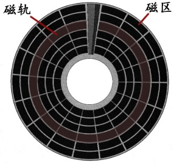

# 外存

：外部存储器，可以在计算机外部迁移，常用于持久性地保存数据。
- 不能被CPU直接读写。外存中的数据要载入内存之后，才能被CPU访问。

## 磁盘

：一种利用磁记录技术存储数据的介质。
- 磁盘（disk）的分类：
  - 软磁盘（soft disk）：早期的磁盘，存储容量小，目前已经淘汰使用。
  - 硬磁盘（hard disk）
- 固态硬盘（SSD）不是采用磁性颗粒存储数据，而是采用闪存颗粒，严格来说不属于磁盘。

### 机械磁盘

如下图，机械硬盘的磁碟上有多个同心圆，被半径分成多个弧道，称为磁区、扇区（Sector）。

- 每个扇区存储512Bytes的数据（实际上外圈的磁区容量较大，浪费了一些空间）。
  - 同一圈的扇区组成一条磁轨、磁道（Track）。
  - 如果有多个磁碟叠在一起，则所有碟上的同一处磁轨组成一个磁柱、扇面（Cylinder）。
  - 磁碟通常有两面可读写数据，每面各有一个磁头（Head）。
- BIOS会自动检测硬盘，计算出其 总容量 = Head数 × Cylinder数 × Sector数 × 512 Bytes 。
  - BIOS采用十进制计算容量，因此它的 1KB=1000B 。

### 主引导扇区

每块硬盘的第一个扇区又称为主引导扇区，它不属于任何分区，不会被格式化分区的命令影响。
- 主引导扇区的大小为 512 Bytes，前 446 Bytes存储一段代码，称为主引导记录；后面的 64 Bytes存储硬盘分区表。
- 主引导记录（Master Boot Record，MBR）：又称为启动引导程序（Bootloader）
  - 用于根据硬盘分区表找到硬盘中存储的操作系统文件，读取并运行它。
- 硬盘分区表（Disk Partition Table，DPT）：存储硬盘的物理分区信息。
  - 比如记录第四个分区是从第301号磁柱到第400号磁柱，挂载到目录/dev/hda4。
  - 把硬盘分区后，不同分区的内容互不影响，可以分别管理，而且磁头读取数据时的搜寻范围变小了。

### BIOS

：基本输入输出系统（Basic Input Output System）
- 是一组固化在ROM中的程序，包括基本输入输出程序、开机后自检程序、系统自启动程序、系统设置信息。
- Legacy BIOS是传统的BIOS启动模式。
  - 使用MBR扇区存储Bootloader。
  - 采用DPT分区表，最多只能存储4个分区的信息。
  - 通常将前三个分区用作主分区，将第4个分区/dev/hda4用作扩展分区，存储额外的分区信息，从而可以分出无数个逻辑分区（编号从5开始）。
     因此，磁盘总容量 = 主分区容量 + 扩展分区容量，扩展分区容量 = 所有逻辑分区容量之和
- UEFI BIOS是现在流行的BIOS启动模式（前身是EFI），只支持64位的系统。
  - 使用ESP（EFI system partition）扇区存储Bootloader。
  - 采用GPT分区表（分区信息存储为efi文件），支持分出无数个硬盘分区。
  - 计算机开机时不需要BIOS自检，而是直接读取Bootloader。

### RAID

：独立冗余磁盘阵列技术（Redundant Array of Independent Disks），将多个磁盘设备组合成一个磁盘阵列使用。

常见的RAID方案：
- RAID 0：将数据拆成几份，同时写入n个磁盘设。
  - 这样读写速度提升到n倍，但不能备份数据，只要有一个磁盘受损，数据就会无法恢复。
- RAID 1：将数据拷贝几份，同时写入n个磁盘。
  - 这样能备份n份数据。但读写速度不变，增加了CPU写数据时的工作量，增加了磁盘成本。
- RAID 5：将数据的奇偶校验信息保存到其它磁盘设备中。当当前磁盘受损时，可以尝试用奇偶校验信息来恢复数据。
- RAID 10：按RAID 0技术部署一组磁盘，并给每个RAID 0磁盘部署一个RAID1磁盘做备份。
  - 这样兼容了RAID 0和RAID 1的优点，能提升读写速度，备份1份数据，性价比较好。

### LVM

：逻辑卷管理器（Logical Volume Manager，LVM），在磁盘设备上建立逻辑卷。
- 优点：
  - 可以创建跨磁盘设备的逻辑卷。
  - 传统的磁盘分区在创建之后不能改变容量，而LVM可以。

## 闪存

：Flash Memory，一种非易失性存储器，断电后数据不会丢失。
- 闪存的擦除：闪存写入时只能从1置0，不能从0置1，因此写入之前要先擦除。
  - 闪存擦除时以扇区为单位。
- 常见的闪存存储技术。
  - NOR：读取速度稍快，擦除、写入速度慢。
  - NAND：支持极高的存储元件密度，因此存储容量大很多。
- 闪存常用作可移动存储介质，比如U盘、SD卡。此外，固态硬盘也是采用闪存颗粒。

## CD

：光盘（Compact Disc），一种利用激光存储数据的介质。
- 光盘技术的发展。
  - CD：80年代开始流行，取代了传统的黑胶唱片、软盘。
  - VCD（Video Compact Disc）：一种存储视频信息的光盘。
  - DVD（Digital Video Disc）：一种存储数字视频的光盘，容量更大，
  - BD（Blue-ray Disc）：蓝光光盘，一种利用蓝色激光存储数据的大容量光盘。
- 根据是否可擦写分类：
  - 不可擦写光盘：只能写入一次数据，写入后只能读取，比如CD-ROM、DVD-ROM。
  - 可擦写光盘：比如CD-RW、DVD-RAM。
