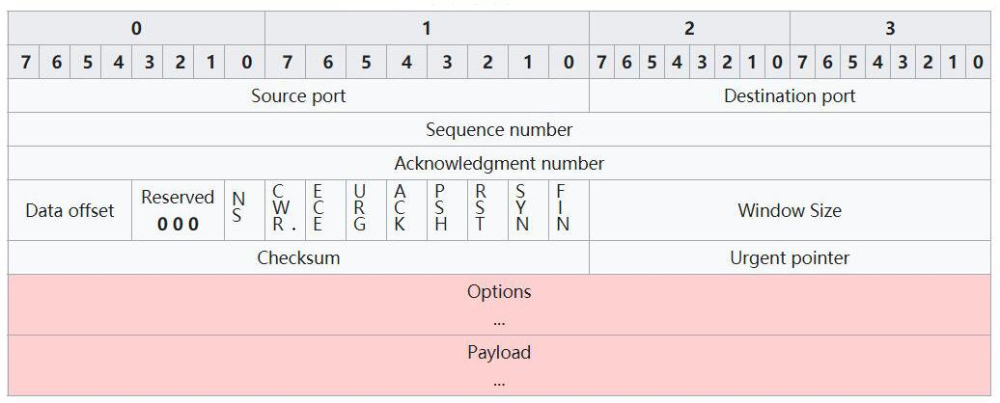

# TCP/UDP

## TCP

：传输控制协议（Transmission Control Protocol）
- 属于传输层协议，规定了网络上的主机之间如何传输数据。
- 采用 C/S 架构，通信双方分别称为 server、client 。
- 特点：
  - 面向连接：通信双方在通信之前要先建立连接，作为信道。
  - 是可靠的通信协议，可保证消息顺序，可进行差错控制、流量控制。
  - 可进行全双工通信。
- 大部分应用层协议都是基于 TCP 进行通信的，比如 HTTP、FTP、SMTP 等。

### 数据包结构

TCP 数据包的结构如下：

- Source Port ：源端口，长度为 16 bit 。
- Dest Port ：目标端口，16 bit 。
- Seq number ：序列号，32 bit ，用于保证消息顺序。
- Ack number ：确认号，32 bit ，表示期望收到的下一个序列号，用于标识符 ACK=1 的情况。
- Data offset ：偏移量，4 bit 。表示 Payload 的起始坐标，即 TCP Header 的总长度。
- Reserved ：保留给未来使用，3 bit ，默认值为 0 。
- Flag ：标志符，9 bit 。每个 bit 代表一个标志位，默认值为 0 。
  - NS
  - CWR
  - ECE
  - URG=1 ：表示该数据是紧急数据，应该被优先处理。
  - ACK=1 ：表示确认。
  - PSH=1 ：表示发送方应该立即将该数据打包成一个 TCP 数据包发送，接收方也应该立即将该数据上报给上层程序。
    - TCP 模块在发送数据时，一般会等发送缓冲区满了，才打包成一个 TCP 数据包发送。同理，接收数据时也一般会等接收缓冲区满了才上报。
    - 一般一个应用层的报文会被切分成多个 TCP 数据包发送，最后一个 TCP 数据包会设置成 PSH=1 。
  - RST=1 ：用于重新建立 TCP 连接，也可用于拒绝连接。
  - SYN=1 ：用于建立 TCP 连接，开始同步。
  - FIN=1 ：用于断开 TCP 连接。
- Window size
- Checksum ：校验和，16 bit 。
- Urgent pointer
- Options
- Payload ：有效载体，即该数据包要传递的实际数据。
  - Payload 之前的其它数据都只是用于描述 TCP 数据包的元数据，称为 TCP Header 。
  - 以太网中网卡的 MTU 通常设置为 1500 ，因此如果 TCP 报文超过该长度，转换成 IP 数据包时就需要拆分成多份。

### 建立连接

- 建立 TCP 连接时需要经过三个步骤，称为 "三次握手" ：
  1. 主机 A 发送一个 SYN=1 的 TCP 包，表示请求连接。
  2. 主机 B 收到后，回复一个 SYN=1、ACK=1 的 TCP 包，表示允许连接。
  3. 主机 A 收到后，发送一个 ACK=1 的 TCP 包，表示正式建立连接。
      - 主机 A 收到第 2 步发送的包时，证明了自己发送的包能被对方接收，而对方发送的包也能被自己接收，因此判断双方能够相互通信。
      - 主机 B 收到第 3 步发送的包时，才判断双方能够相互通信。

- 主动连接方称为 client ，被动连接方称为 server 。
  - 通信双方都要发送一个 SYN、一个 ACK 。
  - 建立连接之后，双方便可以开始正式通信，发送任意个包含有效载体的 TCP 数据包。

### 断开连接

- 断开 TCP 连接时需要经过四个步骤，称为 "四次分手" ：
  1. 主机 A 发送 FIN ，表示请求断开连接。
  2. 主机 B 收到后，先回复 ACK ，表示同意断开连接。\
    准备好了之后也发送 FIN ，请求断开连接。
  3. 主机 A 收到后，发送一个 ACK ，表示自己已经断开连接。
  4. 主机 B 收到后，正式断开连接。
- client、server 都可以主动断开连接。
  - 通信双方都要发送一个 FIN、一个 ACK 。

## UDP

：用户数据报协议（User Datagram Protocol）
- 与 TCP 协议类似，只是面向无连接。
- 通信双方分别称为 sender、receiver 。
- TCP 需要一直运行一个服务器，而 UDP 适合用作即时通信、广播消息。
- 少部分应用层协议是基于 UDP 进行通信的，比如 DHCP、DNS、SNMP、RIP 等。
