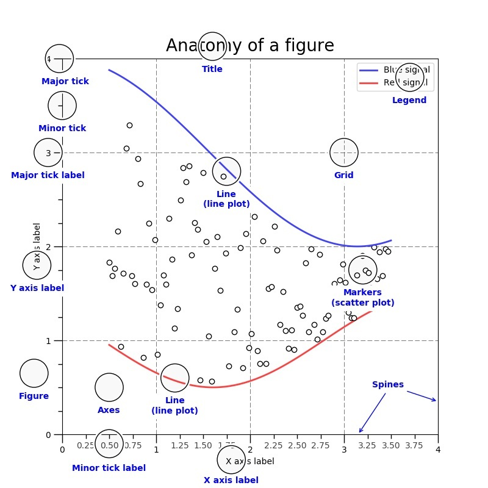

# ♢ Matplotlib

：Python 的第三方库，提供了一些 MATLAB 的绘图函数。
- [官方文档](https://matplotlib.org/users/index.html)
- 安装：`pip install matplotlib`
- [图像效果示例](https://matplotlib.org/tutorials/introductory/sample_plots.html)

## Figure

- Matplotlib 提供了显示图像的 GUI 窗口（Figure）。其结构如下：

  

- 每个 Figure 上可以显示一个或多个坐标区（Axes）。
  - 坐标区的坐标轴（Axis）有多种类型：
    - xy 二维坐标轴
    - xyz 三维坐标轴
    - 极坐标轴

### 显示

```py
>>> from matplotlib import pyplot as plt
>>> x = [1, 2, 3]
>>> plt.plot(x, x, label='line1')         # 绘制一条折线
[<matplotlib.lines.Line2D object at 0x000001F34F904580>]
>>> plt.plot(x, x[::-1], label='line2')   # 绘制另一条折线
[<matplotlib.lines.Line2D object at 0x000001F34F9048E0>]
>>> plt.show()                            # 显示 Figure 
```

- Matplotlib 默认采用非交互模式：
  - 执行 `plt.plot()` 等函数时只会记录图像数据，不会实际绘制。执行 `plt.show()` 才会开始绘制图像，显示 Figure 。
  - Figure 显示期间会一直阻塞前端，直到用户关闭其窗口。
- 在交互模式下：
  - 执行 `plt.plot()`、`plt.show()` 等函数都会立即显示 Figure 。
  - Figure 显示期间不会阻塞前端，从而可以继续执行其它代码来修改 Figure 。
    ```py
    >>> plt.ion()     # 打开交互模式
    >>> matplotlib.is_interactive()
    True
    >>> plt.ioff()    # 关闭交互模式
    ```
- 用 `plt.pause(0.1)` 会显示 Figure ，并阻塞前端 n 秒。

### 关闭

- 显示 Figure 窗口时，如果用户关闭该窗口，则会自动销毁该 Figure 对象。
- Figure 被销毁之后，执行 `plt.show()` 不会作出显示，除非绘制新的 Figure 。
- 可以在代码中主动关闭 Figure ：
  ```py
  >>> plt.close()           # 关闭当前的 Figure
  >>> plt.close(f1)         # 关闭指定的 Figure
  >>> plt.close('test1')    # 关闭指定名称的 Figure（该名称不存在时并不会报错）
  >>> plt.close('all')      # 关闭所有 Figure
  ```

### 排版


设置 Figure 

```py
plt.axis('off')    # 不显示坐标轴
plt.xlabel('x label')
plt.ylabel('y label')
plt.title("Simple Plot")
plt.legend()  # 创建图例（这会自动提取每个折线的 label 名作为图例）


plt.title("Simple Plot")        # 设置图像窗口的标题名
plt.xlabel("X", fontsize=16)    # 设置x轴的名字及其字体大小
plt.ylabel("Y")


# plt.grid(True)        # 显示网格线
# plt.axis([0, 10, 0, 1])        # 设置x轴和y轴的长度（如果设置了，显示时窗口比例会固定，否则会自动调整）
# plt.tick_params(axis="both", labelsize=10)  # 选择显示两条坐标轴，并设置坐标轴数字的大小

plt.savefig("test1.png")    # 保存图像


plt.cla()                # 对当前figure中的所有坐标轴执行axes.cla()，清除其中的图像
plt.clf()                 # 清除当前figure中的所有坐标轴
```


### 后端

- Matplotlib 将执行代码的线程称为前端，将显示 Figure 的线程称为后端。
- 管理 Matplotlib 后端的 GUI 引擎：
  ```py
  >>> matplotlib.get_backend()    # 查看当前引擎
  'TkAgg'
  >>> matplotlib.use('qt5agg')    # 使用指定的引擎
  ImportError: Failed to import any qt binding
  ```

### 多个 Figure

- 默认是对单个 Figure 进行操作，也可以创建多个 Figure ，如下：
  ```py
  >>> f1 = plt.figure('test1')  # 创建一个 Figure ，并设置其名称
  >>> f2 = plt.figure('test1')
  >>> f3 = plt.figure('test3')
  >>> plt.show()                # 这会同时显示所有 Figure 窗口
  ```

- 如果新 Figure 与旧 Figure 重名，则不会创建它，而是返回旧 Figure 的引用。
  ```py
  >>> f1 == f2
  True
  >>> f1 == f3
  False
  ```

### Subplot

- 每个 Figure 上可以显示一个或多个子图（Subplot）：
  ```py
  >>> fig, axes = plt.subplots(2, 2)    # 创建一个 Figure ，在其中划分 2 行、2 列个子图
  >>> fig
  <Figure size 640x480 with 4 Axes>
  >>> axes                              # axes 数组中，每个元素对应一个子图的 axes
  array([[<AxesSubplot:>, <AxesSubplot:>],
        [<AxesSubplot:>, <AxesSubplot:>]], dtype=object)
  >>> ax1 = axes[0, 0]                  # 选中第一个子图的 axes
  >>> ax1.plot(x, x)
  [<matplotlib.lines.Line2D object at 0x000001F35B72B1F0>]
  >>> plt.show()
  ```


## 折线图

- 例：
  ```py
  >>> x = list(range(1, 10))
  >>> y = list(range(-1, -10, -1)) 
  >>> plt.plot(x, y)    # 绘制一条折线，x、y 数组分别表示各个点的 x 轴、y 轴坐标，两个数组的长度必须相同
  [<matplotlib.lines.Line2D object at 0x000001F35773F820>]
  >>> plt.plot(y, x, label='line2', linestyle='', marker='.')  # 绘制第二条折线，它是散点线
  [<matplotlib.lines.Line2D object at 0x000001F35801BB20>]
  >>> plt.show()
  ```

- `plt.plot()` 的常用参数：
  - `label='xx'` ：名称
  - `linewidth=1.0` ：线宽
  - `linestyle='-'` ：线型
  '-', '--', '-.', ':', 'None', ' ', '', 'solid', 'dashed', 'dashdot', 'dotted'
  - `marker=''` ：在每个点处显示的标记
  - `color='#008000'` ：线的颜色。每次绘制时，默认会按特定顺序分配颜色，比如蓝、橙、绿……
  - `` ：
  - `` ：
  - `` ：
  - `` ：


- 节点的形状有以下几种：
  - `s` ：正方形
  - `o` ：圆形
  - `^` `>` `v` `<` ：正三角形（四种朝向）
  - `d` ：正菱形
  - `p` ：正五边形
  - `h` ：正六边形
  - `8` ：正八边形

- 线型有以下几种：
  - `solid`   ：实线
  - `dashed`  ：虚线
  - `dotted`  ：点线
  - `dashdot` ：点划线


例：绘制动态折线图
```py
import random


plt.ion()
last_dot = [0, 0]
for i in range(100):
    new_dot = [i, random.randint(0, 10)]  # 设置当前点的坐标
    plt.plot([last_dot[0], new_dot[0]], [last_dot[1], new_dot[1]], color="blue")
    last_dot = new_dot
    plt.pause(0.1)

# 每次循环绘制一条新线段。并采用统一的颜色
```

## 显示图片

```py
>>> from matplotlib import pyplot as plt, image
>>> img = image.imread(r'./1.jpg')  # 读取本地图片
>>> type(img)                       # 读取到的图片对象存储在 numpy 数组中
<class 'numpy.ndarray'>
>>> img
array([[[ 72, 164, 201],
        [ 64, 156, 193],
        [ 66, 158, 195],
        ...,
        [  0,  54,  74],
        [  0,  53,  73],
        [  0,  54,  74]]], dtype=uint8)
>>> p1 = plt.imshow(img)            # 将图片导入 Figure 
>>> plt.show()                      # 显示 Figure 
```

## 绘图函数

所有绘图功能均预期numpy.array或numpy.ma.masked_array作为输入。


绘制动态图：https://blog.csdn.net/rumswell/article/details/11731003
mpl_toolkits库用于绘制三维图，参考：https://blog.csdn.net/chi_wawa/article/details/68062506

