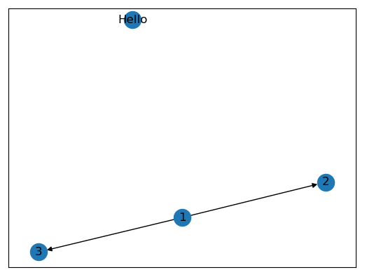

# ♢ NetworkX

：Python 的第三方库，用于绘制无向图、有向图等图结构。
- 安装：`pip install networkx`
- [官方文档](https://networkx.github.io/documentation/stable/)

## 用法

基础示例：
```py
>>> import networkx as nx
>>> g = nx.Graph()              # 创建一个空的无向图
>>> g = nx.DiGraph()            # 创建一个空的有向图
>>> g.add_node(1)               # 添加一个节点
>>> g.add_node('Hello')         # 节点的内容可以是数字、字符串等，根据哈希值区分
>>> g.add_nodes_from([2, 3])    # 从可迭代对象添加多个节点
>>> g.add_edge(1, 2)            # 添加一条边（如果节点不存在，则会自动创建）
>>> g.add_edges_from([(1, 2), (1, 3)])
>>> g.nodes
NodeView((1, 'Hello', 2, 3))
>>> g.edges
EdgeView([(1, 2), (1, 3)])
```
- 无向图：
  - 一条边是连接任意两个节点的线段，甚至可以连接同一个节点（称为自循环）。
  - 任意两个节点之间最多只能存在一条边，不能存在多条边（称为平行边）。
- 有向图：
  - 在边的某一端加上一个箭头。
  - 任意两个节点之间最多只能存在一条边，这条边上最多有两个箭头。

绘制图像：
```py
from matplotlib import pyplot as plt
nx.draw_networkx(g)
plt.show()
```

