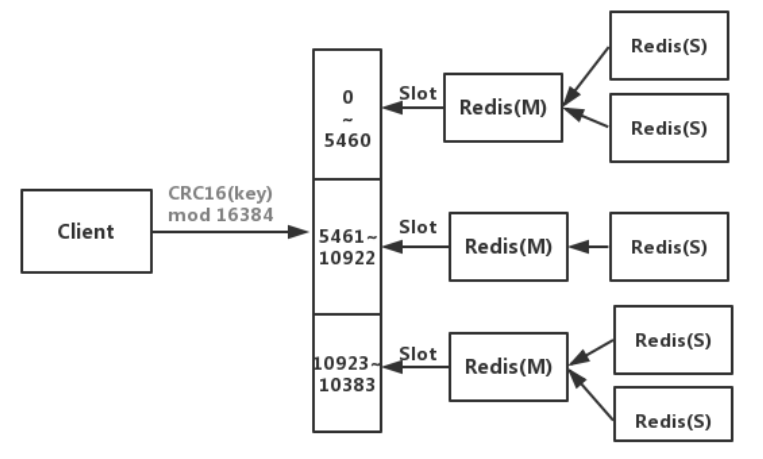

# Cluster集群

## 架构

- 将整个集群空间划分成 16384 个槽位（slot），将每个写入的key随机分配到一个slot中。
  - 给key分配slot的算法是 `CRC16[key]%16384` ：先计算key的CRC16哈希值，再对16384取模，结果就是要分配的slot序号。
  - 客户端可以访问集群中的任一node，如果读取的key不存在，则请求会被转到正确的node。
- 集群中的每个node存储一部分slot。
  - 如果一个node挂掉，则它存储的所有slot都会丢失。因此通常把每个node部署成主从架构，以保证高可用。
  - 当集群中的node增加或减少时，就需要重新给每个节点分配slot，这会导致key的迁移。
- 优点
  - 容易横向扩展。
- 缺点
  - 操作多个Key时，它们可能存储在不同的Redis中，导致不能进行mset等批量操作、不能实现事务的原子性。
  - 只能使用0号数据库。
